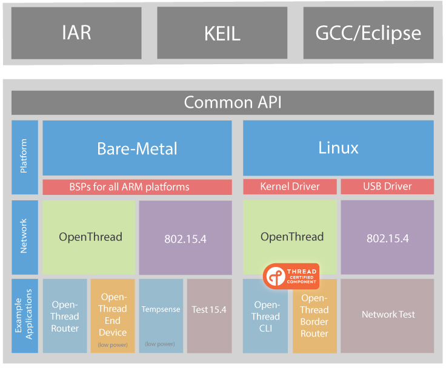

<p align="center"></p>

# Cascoda SDK

The Cascoda SDK includes a comprehensive set of tools for developing systems integrating Cascoda hardware. The SDK is designed to be cross platform and flexible, enabling designing on one system and porting to another with ease. Example applications are included in order to demonstrate use of the systems.

The SDK contains a general API which abstracts the functionality of the CA-8210 or CA-8211, and can be run on baremetal or Linux systems.

<p align="center"></p>

The Bare-Metal BSPs provide a set of common functionality for baremetal platforms, with a simple abstraction layer that can be easily ported to new systems. The Linux platform takes advantage of the extra functionality to enable control of multiple devices at a time, and dynamic selection of SPI/USB Cascoda devices.

## Building

### CMake
The Cascoda SDK makes full use of CMake as a build system, to enable advanced configuration and cross-platform development. In order to build the Cascoda SDK, you will require CMake version 3.13 or newer. This can be downloaded from the [CMake Website.](https://cmake.org/download/)

### Compilers
The Cascoda SDK can be built natively for Linux using any preferred native compiler.

For Cross-Compiling to baremetal, we have fully implemented the ARM GCC compilers for use. They can be downloaded [here.](https://developer.arm.com/open-source/gnu-toolchain/gnu-rm/downloads) The code can be built in other embedded compilers, and full integration in the CMake suite is coming soon. Currently the OpenThread library can only be built from a Linux system (Windows Subsystem for Linux also works). For building openthread, certain extra packages must be installed:

```Bash
sudo apt install automake libtool lsb-release libhidapi-dev -y
```

### Instructions
To build the Cascoda SDK, follow the instructions below (written for Linux):

```Bash
# Make a working directory
mkdir cascoda
cd cascoda
# Clone the Cascoda SDK
git clone https://github.com/Cascoda/cascoda-sdk.git

# Create a build directory for native build, and build the SDK
mkdir sdk-posix
cd sdk-posix
cmake ../cascoda-sdk
make -j12
# Built for current system! To change configuration, the 'ccmake .' command can be used

#Go back to working directory
cd ..

#Now cross compile for the Chili2
mkdir sdk-chili2
cd sdk-chili2
cmake ../cascoda-sdk -DCMAKE_TOOLCHAIN_FILE="toolchain/arm_gcc_m2351.cmake"
make -j12
# Built for Chili 2! To change configuration, the 'ccmake .' command can be used
```

Libraries will be built into the ``lib/`` directory, while application binaries will be built into the ``bin/`` directory. For the Chili platforms, both elf format and binary .bin format files will be created.

In order to compile for the Chili 1, or to use a different compiler, the CMAKE_TOOLCHAIN_FILE argument can be pointed to a different configuration file in the toolchain directory.

### Debugging
The Chilis support flashing and debugging via the [Segger J-Link](https://www.segger.com/products/debug-probes/j-link/) using [JTAG SWD](https://en.wikipedia.org/wiki/JTAG#Serial_Wire_Debug). When using the GCC toolchain, the SEGGER GDB Server and arm-none-eabi-gdb can be used to flash and debug the Chili. Simply setup the JLink GDB server for the NANO120 (Chili 1) or M2351 (Chili 2) with SWD, then `target remote 127.0.0.1:2331` in arm-none-eabi-gdb to connect to it. If debugging is not required, then the Segger J-Flash lite tool can flash plain binary files.

The Chilis can also be [debugged with a NuLink Pro.](docs/guides/how-to-debug-with-a-nu-link-pro.md). This is a cheaper alternative, but the developer experience is inferior - you cannot flash the Chili from withing GDB, and setting & getting to breakpoints is slower.

## Directory layout

### ca821x-api
[ca821x-api](ca821x-api/README.md) contains the cross-platform API which abstracts all of the functionality of the CA-8210 and CA-8211. It is required for every project.

### baremetal 
[baremetal](baremetal/cascoda-bm-driver/README.md) contains the cross-platform baremetal drivers, some example applications, and a set of platform abstractions. The baremetal drivers implement useful, cross-platform functionality, and should be your go-to API when trying to interact with peripherals and outside world.

The platform abstractions (sometimes referred to in the source code as the Board Support Package) are what enables the baremetal drivers to be cross-platform. They provide a set of functions which abstract away the specifics of what platform you are dealing on, such as how to set up the device and how to communicate with peripherals.

While you _could_ use the BSP functions (declared in `cascoda_interface.h`) to control the chip from your top-level application, it is a lot easier to rely on the functionality provided by the baremetal drivers, such as the functions in `cascoda_time.h`, `cascoda_evbme.h` and so on.

### docs
`docs` contains the following guides:

- [Cross-compiling for the Raspberry Pi](docs/guides/how-to-cross-compile-for-the-raspberry-pi.md)
- [M2351 TrustZone Development Guide](docs/guides/M2351-TrustZone-development-guide.md)
- [Debugging with a NuLink Pro](docs/guides/how-to-debug-with-a-nu-link-pro.md)

### toolchain
`toolchain` contains the platform configuration files to enable cross compilation for different systems and compilers. These are used to first set up the CMake toolchain for a specific platform, as seen in [the Instructions settings](#Instructions). There is extra info on how to compile for different targets in docs, such as [cross compiling for the raspberry pi.](docs/guides/how-to-cross-compile-for-the-raspberry-pi.md)

### posix
[posix](posix/ca821x-posix/README.md) contains the Posix-specific drivers and tools, as well as some example applications that can be run from a Linux system.

### openthread
`openthread` contains the glue configuration to download the openthread repository from https://github.com/Cascoda/openthread, and configure it to be built with the SDK.

### etc
`etc` contains miscellaneous resources.

## CMake Targets

Useful CMake target libraries to include:

| Target | Description |
| :---   | :--- |
| ca821x-api | The core Cascoda API, including C function representations of all CA-821x functionality. |
| cascoda-bm | The baremetal Cascoda Drivers, abstracting away the platform to a common interface, and providing a suite of helper functions |
| ca821x-posix | The posix Cascoda driver interface, supporting USB, UART or SPI communications to a connected Cascoda device |
| sensorif | A library containing drivers for interfacing with I2C sensors |
| ca821x-openthread-bm-ftd | OpenThread baremetal library for FTDs (Full Thread Devices)|
| ca821x-openthread-bm-mtd | OpenThread baremetal library for MTDs (Minimal Thread Devices) |
| ca821x-openthread-posix-ftd | OpenThread posix library for FTDs |
| ca821x-openthread-posix-mtd | OpenThread posix library for MTDs |
| openthread-cli-ftd | OpenThread CLI library for FTDs |
| openthread-cli-mtd | OpenThread CLI library for MTDs |
| openthread-ncp-ftd | OpenThread NCP library for FTDs |
| openthread-ncp-mtd | OpenThread NCP library for MTDs |
| freertos-default-secure | The basic FreeRTOS & TrustZone target, containing FreeRTOS secure code and the secure parts of the BSP |
| freertos | The non-secure FreeRTOS code, meant to be used with `freertos-default-secure` |

## Useful Links

- [Cascoda Posix Thread Description](posix/ca821x-posix-thread/Readme.md)
- [Baremetal Temperature Sensing Application](baremetal/app/tempsense-bm/README.md)
