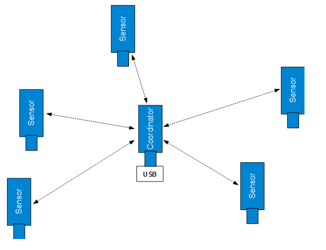
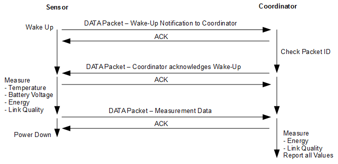

# tempsense-bm

Temperature sensor application utilising the IEEE802.15.4 MAC layer functionality to establish a star network with one central
coordinator and up to 32 battery-powered temperature sensor end nodes. The coordinator uses USB HID mode for host communications to Cascoda's
Wing Commander GUI.

<em>tempsense network configuration</em>

When starting up as coordinator the device scans a number of 2.4 GHz band channels (by default channels 11, 18 and 24, the list of channels can be changed in the source code) for the lowest energy level and selects the best channel. It will automatically send out a beacon when receiving a beacon request from a sensing node, respond to an association request and allocate a serial device number as short address. It will then report the sensing node data upstream for display with the Cascoda WingCommander GUI. 
If the device detects that it is unplugged from USB and running on battery power, it automatically changes into sensor mode. It wakes up at a programmed wake-up interval (by default 5 seconds), and when not attached to a coordinator it initiates an active scan and sends out beacon request commands to detect a coordinator in its range. After a coordinator has been detected the sensor device starts an association sequence to associate with the coordinator. If the association sequence is successful, the sensor device then exchanges data with the coordinator at every wake-up interval: 

<em>tempsense data exchange</em>

If the coordinator detects that a specific sensor device did not communicate for several wake-up intervals, it disconnects the sensor and frees the device entry up for another sensor device to be connected. At the same time, if a sensor device has not had any communications with the coordinator for several wake-up intervals, it reverts to scanning for a coordinator in its vicinity. 
For each detected sensing device the following data is displayed by the coordinator in the GUI: 

| Data   | Description |
| :---   | :--- |
| TS     | Sensor device identification number (lower byte of assigned short address of device) |
| N      | Measurement sequence number for specific sensor (32-bit value) |
| T      | Temperature measured by sensor in [°C] |
| Vbat   | Measured battery voltage [V] of sensor. A warning is issued if the voltage drops below 2.5 V |
| LQI TS | Link Quality Indication value, received by sensor |
| LQI C  | Link Quality Indication value, received by coordinator |
| ED TS  | Energy Detect value, received by sensor |
| ED C   | Energy Detect value, received by coordinator |

The unsigned 8-bit LQI value is a measure of the signal quality of the received and demodulated IEEE802.15.4 radio signal. A LQI of 255 is indicating very good signal quality and full signal correlation. The LQI value drops sharply when the received signal is reaching the receiver sensitivity limit (threshold behaviour). 
The Energy Detect value ED is equivalent to Received Signal Strength Indication (RSSI). This unsigned 8-bit value is a measure of the energy in the specific IEEE802.15.4 channel. The step size is 0.5 dB. Note that the measured energy is not necessarily an IEEE802.15.4 signal but could come from any signal source operating in the 2.4GHz ISM band such as Wifi. In the linear region (from around -95 dBm to -30 dBm) the received signal power can be calculated by the following formula: 

<em>Pin [dBm] = (ED – 256)/2</em>

