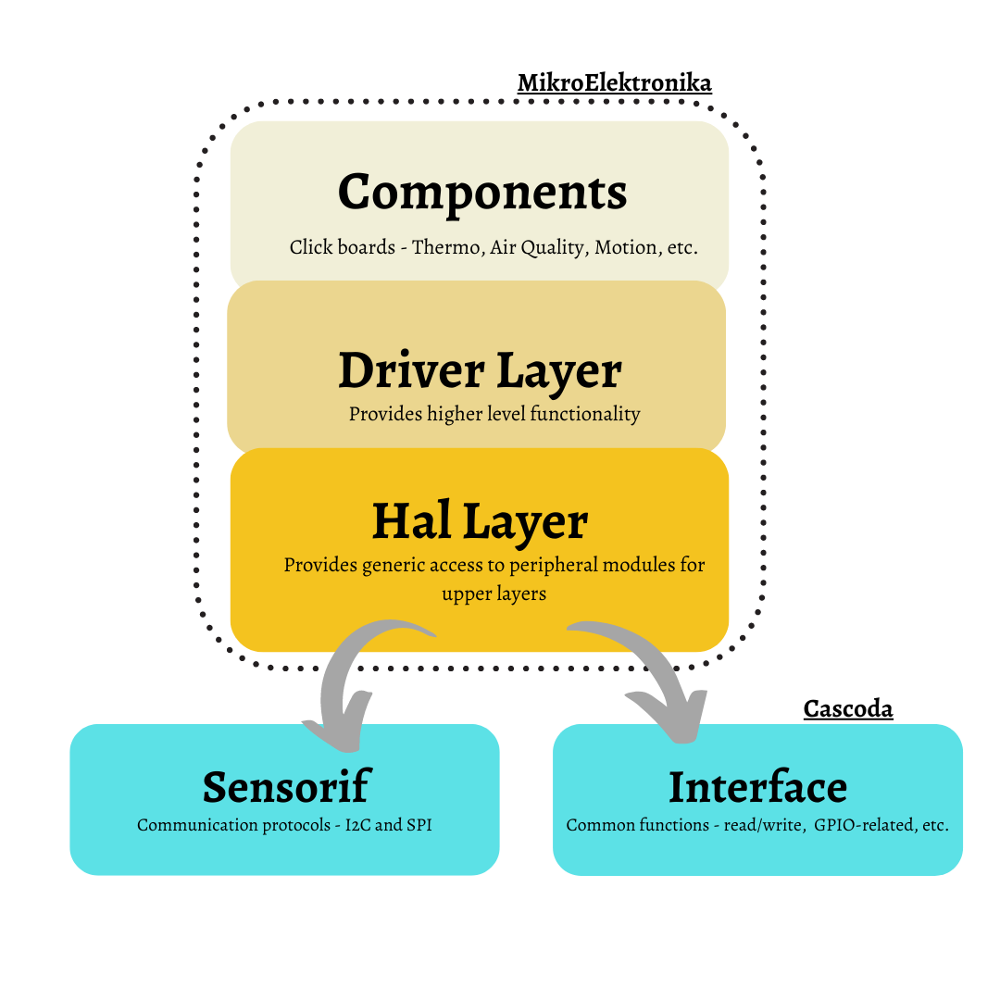

# mikrosdk-lib

This directory contains the adaptation of the Mikroelektronika library for the firmware used in ``baremetal/cascoda-bm-driver``. 

It allows easy setup for MikroElektronika Click Boards to communicate with the Chili2 platform. More information about the MikroElektronika library can be found [here](https://github.com/MikroElektronika/mikrosdk_v2).

## Hardware Abstraction Layer (HAL)
The HAL layer provides common peripheral functionality, abstracting the low-level hardware details. This layer is the bridge between Cascoda's SPI and I2C drivers and the MikroElektronika library.

## Driver Layer (DRV)
The DRV layer is a software API which makes use of the HAL layer and provides higher level functionality, such as initialising and handling peripherals.

 

