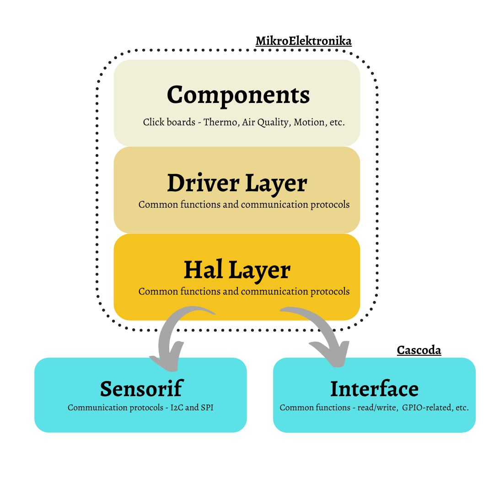

# mikrosdk-lib

This directory contains adaptation of Mikroelektronika library to the firmware used in ``cascoda-bm-driver``. 

It allows easy setup for MikroElektronika Click Boards to communicate with chili2 using our platform. Information about MikroElektronika library can be found [here](https://github.com/MikroElektronika/mikrosdk_v2).

## Driver Layer (DRV)
The Driver layer is an API describing the interfaces between middle-ware stacks and user applications. It implements common protocols such as I2C and SPI and simple GPIO configuration. This is positioned in between the user interface and HAL layer.

## Hardware Abstraction Layer  (HAL)
The HAL layer provides common peripheral functionality, abstracting the low-level hardware details. This layer is the bridge between Cascoda communication platform and MikroElektronika library. This layer implements communication protocols such as I2C, SPI and simple GPIO configuration.

 

