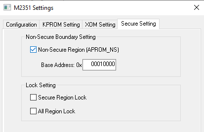
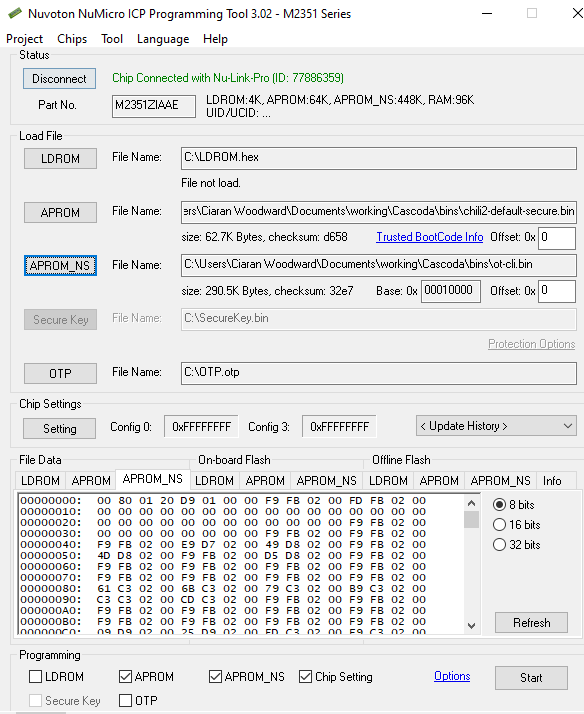

# TrustZone Development Guide #

This guide is a development guide for working with the Cascoda SDK and TrustZone.
Some familiarity with the CMake build system is assumed, but the first section is
an overview, not specific to the Cascoda SDK.  Therefore, this guide should also
be useful if not using CMake.

The guide is split into 3 sections:

- [TrustZone Overview](#trustzone-overview)
- [Using TrustZone with the Cascoda SDK](#using-trustzone-with-the-cascoda-sdk)
- [Common Pitfalls in TrustZone development](#common-pitfalls)

## TrustZone Overview ##

### What is TrustZone? ###

The purpose of TrustZone is to separate secure (trusted) code and data from
non-secure (untrusted) code. This is accomplished by hardware within the Arm
core, which makes the separation very robust. The benefit is forbidding untrusted
code from reading, modifying or freely executing secure code and data.

TrustZone also allows the secure firmware developer to mark MCU peripherals
as trusted or untrusted. Thus, trusted hardware can only be accessed from
secure code (inaccessible to the non-secure world), while non-trusted
hardware can be accessed by both.

Overall, secure (trusted) code has access to the entire memory space & CPU
peripherals, while non-secure (untrusted) code only has access to peripherals
and regions marked as non-secure and non-secure callable by the secure
bootloader.

### What does TrustZone software look like? ##

The trust separation is reflected in the way TrustZone programs are compiled and
linked. Two different binaries are produced by the build system:

- A secure binary, compiled with the `-mcmse` flag of `arm-none-eabi-gcc`.
The secure binary usually contains code for booting the chip, as well as
secure APIs that can be accessed by untrusted code.

- A non-secure binary, which contains application code. The non-secure binary
cannot talk to the secure world except through non-secure callable functions
defined in secure code.

These binaries must be flashed separately, at different addresses. This
preserves the separation between trusted and untrusted code. Untrusted
software is entirely separate from the secure binary, and only knows about
a specifically defined 'non-secure callable' subset of API functions.

The start address of non-secure firmware must be known by:

- The secure firmware, in order to successfully boot into the non-secure
application code. (This is handled by the build system)

- The non-secure linker script, so that the absolute address of non-secure
symbols is known. (This is handled by the build system)

- The tool that flashes the two binaries onto the microcontroller, in order
to position the non-secure code at the correct place in flash. (This is important
to remember when flashing binaries)

### Communicating between worlds ###

The secure firmware has access to the entire system. The non-secure
firmware only has access to the parts deemed non-secure by the secure
firmware.

The secure firmware can choose to provide an API to non-secure code through
non-secure callable (NSC) functions (also known as entry functions). This allows
non-secure code to access secure resources in a way that is safe, without
breaking the security guarantees set in place by the secure software developer.
The non-secure code does not need to do anything special to call an NSC function,
as this is handled by the toolchain.

Secure code can securely access non-secure code using function pointers. The
secure world can call the function pointer (a non-secure function) using the ``BLXNS``
instruction, which is practically used in C code by marking the function pointer
with the ``cmse_nonsecure_call`` attribute. Function pointers must be used
because the nonsecure binary is linked with the symbols from the secure binary,
but the opposite does not occur. When the nonsecure function is called, the hardware
ensures that the code only has access to the nonsecure parts of the system.

Here is a trivial example that demonstrates this concept in secure code:

The secure binary defines a NSC function called `call_the_callback`. Its
argument `callback` is a function pointer. The nonsecure code can call the
``call_the_callback`` function with a function pointer to nonsecure code
as an argument. The secure code is able to safely call `callback` while in a
secure state, without compromising the secure-nonsecure barrier.

```
// in secure.c
#include <arm_cmse.h>

// Type for non-secure callback. The attribute instructs the compiler to safely
// call the non-secure function
typedef int (*nonsecure_callback_t)(int) __attribute__((cmse_nonsecure_call));

void call_the_callback(int (*callback)(int));
int do_secure_stuff_with(int);
int secure_get_int(void);

__attribute__((cmse_nonsecure_entry)) int call_the_callback(int (*callback)(int))
{
    int rval = secure_get_int();
    rval = ((nonsecure_callback_t) cmse_nsfptr_create(callback)) (rval);
    // Use the result for some secure work
    rval = do_secure_stuff_with(rval);
    return rval;
}

```

The non-secure binary defines `function_for_secure`, the callback for the
secure binary, which is then passed to the secure code within `main`.

```
// in the non-secure main.c

int function_for_secure(int i)
{
    //This function is nonsecure, so cannot access any secure
    //state, even though it is called from secure code.
    return (i+1);
}

void main()
{
	int rval = call_the_callback(&function_for_secure);
	printf("rval: %d\n", rval);
}
```

### Implementation detail: Secure Gateway Veneers ###

Changing between the secure and non-secure worlds is potentially dangerous.
If it is not designed carefully, untrusted software may gain access to the
entire system.

To mitigate this problem, TrustZone hardware allows the developer to define
non-secure callable regions. These regions are the only place where
non-secure code can execute the `SG` instruction (Secure Gateway) and switch to
the secure world.

The non-secure callable region must only contain secure gateway veneers: very
short functions consisting of the SG instruction and a jump to secure code.
The secure binary defines its non-secure API by creating these secure gateway
veneers.

Therefore, non-secure entry functions are composed of two parts:

- The main body of the function, which lies somewhere in the secure flash and
contains the actual code of the function.

- The secure gateway veneer, which lies in the non-secure callable region.

The developer does not have to worry about the distinction between SG veneers
and the actual code of the functions, since this is all handled by the
compiler & linker. However, the veneers will be noticed if using a debugger
to step through non-secure callable functions.

### Cascoda and TrustZone ###

The Cascoda SDK defines a single secure TrustZone target. This is
`chili2-default-secure`: a secure binary that contains FreeRTOS
secure code, as well as the Cascoda BSP. This secure binary is what powers
the Cascoda SDK TrustZone examples. It may be used as a reference if developing
alternate secure firmware.

The non-secure callable API is defined through the use of the
`__NONSECURE_ENTRY` macro, defined in `system_M2351.h`. This macro marks a
function as non-secure callable, which generates a SG veneer and places it in
the non-secure callable region.

The macro is used immediately before the function definition:

```
__NONSECURE_ENTRY void BSP_PowerDown(
    u32_t sleeptime_ms,
    u8_t use_timer0,
    u8_t dpd,
    struct ca821x_dev *pDeviceRef
    )
{
	u8_t  lxt_connected = 0;
	u32_t timeout_sec;
    ...
    ...

```

Further examples can be found in the Chili 2 version of
`cascoda_bsp_chili.c`.

## Using TrustZone with the Cascoda SDK ##

### Enabling TrustZone ###

To enable trustzone in the Cascoda SDK for Chili 2, simply change the CMake cache variable
``CASCODA_CHILI2_TRUSTZONE`` from ``OFF`` to ``ON``. This will cause
the secure binary `chili2-default-secure` to be built, and correctly configure
all of the example applications to build as nonsecure mode binaries. Note that when
this option is enabled, the generated binaries can no longer be used without `chili2-default-secure`.
To revert to non-trustzone builds, the ``CASCODA_CHILI2_TRUSTZONE``
can be set to ``OFF``. As with any CMake configuration change, the SDK should then be rebuilt.

### Building TrustZone ###

Building TrustZone enabled binaries using the Cascoda SDK does not require any special process other than
enabling the cache variable. The additional `chili2-default-secure` binary will be built, and all
other applications will be configured to use TrustZone.

### Flashing TrustZone ###

Flashing TrustZone binaries to the M2351 is more complex than flashing non-trustzone applications, as two seperate
binaries must be flashed to different locations. By default, when 64kb of flash is reserved for the secure firmware,
the secure firmware is flashed to address ``0x00000000`` and the non-secure firmware is flashed to ``0x10010000``.
The non-secure start address takes into account the different address space for secure/nonsecure code, and also the
64kb offset. There are two suggested methods of flashing trustzone code:

- Using a SEGGER J-Link and GDBServer
- Using a Nuvoton Nu-Link Pro and [the Nuvoton ICP Programming Tool](https://www.nuvoton.com/tool-and-software/software-development-tool/programmer/)

**NOTE: After flashing TrustZone code, you will need to full-erase the device before being able to flash non-TrustZone code again. The NuLink must be used for this.**

#### Flashing with SEGGER J-Link and GDBServer

This method enables both flashing and debugging simultaneously, so is useful for development.

1. Connect SEGGER J-Link to the Chili 2 and to USB. Make sure the Chili 2 is powered.
2. Run the segger GDBServer program with the command ``JLinkGDBServer -select USB -device M2351KIAAE -endian little -if SWD -speed 50000 -noir``
    - Other configurations are possible, but consult the J-Link documentation for more info
    - There is also a GUI version available - `JLinkGDBServerExe`
3. Start either 'arm-none-eabi-gdb' or 'gdb-multiarch' (depending on installation) in the build directory with the following command:
    - ``arm-none-eabi-gdb -ex "target remote localhost:2331" -ex "file bin/chili2-default-secure" -ex "load bin/ot-cli -0x10000000" -ex "add-symbol-file bin/ot-cli" -ex "load" -ex "monitor reset"``
    - change both instances of `ot-cli` to the desired application
4. Answer 'y' to every prompt
5. Use gdb to run & debug the application

#### Flashing with Nuvoton Nu-Link Pro

1. Connect the Nuvoton Nu-Link to the PC and the Chili 2. The Chili 2 does not need external power.
2. Run [the Nuvoton ICP Programming Tool](https://www.nuvoton.com/tool-and-software/software-development-tool/programmer/)
3. Set the 'APROM' file to the ``chili2-default-secure.bin`` binary.
4. Set the 'APROM_NS' file to the desired application binary.
5. Open the Chip Settings menu, and set the Non-Secure region address to '0x00010000'
<p align="center"></p>
6. Check the 'APROM', 'APTOM_NS', 'Chip Setting' boxes
7. Click 'Start'

<p align="center"></p>

### Advanced: Changing the address space partition (ROM and RAM) ###

The allocation of secure and non-secure memory and flash is decided in the
`partition_M2351.h` file. The Cascoda SDK contains two such files: one for
the secure binary, and a default one for non-TrustZone targets. If different secure
characteristics are required, the partition file of the secure binary should be
modified. The partition file of the default secure binary (the `chili2-default-secure`
target) can be found at
`baremetal\platform\chili2\port\include_tz\partition_M2351.h`.

To change the allocation of ROM and RAM, the
`SCU_SECURE_SRAM_SIZE` and `FMC_SECURE_ROM_SIZE` within the
`partition_M2351.h` of the secure binary must be modified.

The linker scripts (for instance, `secure.ld` and `nonsecure.ld` within
`chili2-default-secure`) must also be modified by changing the `FLASH`,
`RAM` and `__top_veneer_table` to be consistent with the settings in
`partition_M2351.h`. Failing to do so will usually result in hard faults (for
instance, if the CPU is running non-secure code when it reaches the point of
inconsistency) or reading all zeroes from the stack and possibly executing
null instructions (if the CPU is in the secure mode). Cascoda aims to make these
configurable using the build tool in a future SDK release - please contact us if you
have a need for this.

### Advanced: Configuring peripherals as secure or non-secure ###

The security status of peripherals is stored as integers within the
`partition_M2351.h` file, where each bit of the integer represents the
security status of a peripheral. 0 indicates the peripheral is secure, and 1
represents non-secure peripherals.

For instance, changing bit 24 of `SCU_INIT_PNSSET0_VAL` to 0 would make the
`PDMA1` peripheral accessible only to code running in secure mode.

Several peripherals on the M2351 can only be accessed in secure mode. They are `SYS`,
`CLK`, `NMI`, `PDMA0`, `RTC`, `FMC`, `SCU`, `WDT` and `TMR01`.

### Advanced: Adding non-secure callable functions ###

If application-specific non-secure callable functions are required then they must be
added to the secure binary. Currently the only way to do this is to modify the Cascoda
SDK ``chili2-default-secure`` binary, but Cascoda plans to enable a method of
injecting additional behaviour from a parent application. The `__NONSECURE_ENTRY`
macro should be used to mark a function as non-secure callable.

## Common pitfalls ##

### The security status bit of an address is implementation specific ###

The M2351 uses bit 28 of an address to indicate whether the address refers to
secure or non-secure code, data or peripheral. When bit 28 is low, the
address should point to something secure, and vice-versa. **This convention
is platform specific**, check the datasheet if a different MCU is used, because
getting this wrong makes things very difficult. This information will be
in the section describing the IDAU (Implementation Defined Attribution Unit).

### Read All Zeroes, Write Ignore

In our experience, bugs within TrustZone code often result in runtime
errors that are very difficult to investigate.

The most common cause of such issues is if the security status of a
peripheral is different from the security status of the address used to
control that peripheral.

Accessing a secure peripheral using a non-secure address generally results in
hardfaults. Accessing a non-secure peripheral using a secure address is even
more insidious: it can result in the access failing transparently - reading
from the address returns all zeroes and writing to the address is silently
ignored. This is referred to in the datasheet as RAZWI (Read All Zeroes,
Write Ignore).


For instance, at one point in development, the CPU started hardfaulting
within the secure binary while configuring some peripherals. The debugger
revealed that the hardfault occurs when the CPU attempted to write to an
address that looks like `0x0000 0128`, which lies within program memory and
cannot be directly written to. The actual peripheral that is supposed to be
accessed lives at address `0xefff 0128`, which is similar to what the write
attempted to do, but lacks a critical offset.

Looking at the assembly reveals that `0xefff 0000` was put by the compiler
onto the stack (the alternative would be to hardcode it as part of an
immediate-mode instruction) because it was used in several writes. However,
the secure stack was accidentally misconfigured to live within non-secure
memory. Therefore, in order to write to the peripheral, the CPU tried reading
from the stack using the secure alias of the stack pointer. Since the stack
was configured as non-secure, reading from it always returns 0 and writing is
ignored (RAZWI).

### GCC cannot compile secure functions with arguments passed on the stack

Unfortunately, `arm-none-eabi-gcc` does not yet feature support for passing
arguments on the stack, or even putting the return result on the stack. They
must all reside within registers. This means that code which uses too many
arguments, or arguments that are larger than 32 bits will fail to compile.
Similarly, code that returns values larger than 32 bits will also fail.

The workaround for this issue is replacing the arguments with a pointer to a
struct which holds the same data. Since the pointer is 32 bits, it will be
passed to the function using a register.

For returning large amounts of data, a pointer argument to which the return
data is copied can be used.

### GCC has a compiler bug for nonsecure callable functions in combination with -Os

Do not use the -Os optimisation flag for the secure binary, or the compiler will generate
incorrect code. This workaround is handled by the cascoda SDK and there is also a
runtime trap to catch incorrect behaviour. Tracked here: https://gcc.gnu.org/bugzilla/show_bug.cgi?id=95646