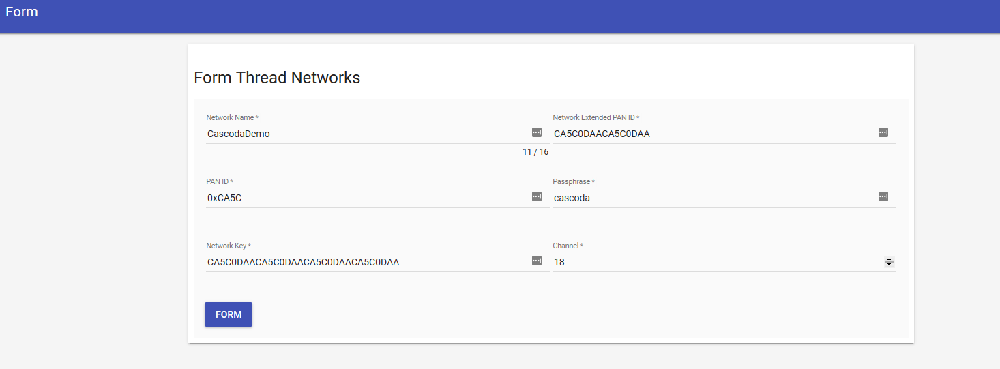

# Border Router Setup

Cascoda provides an example Thread Border router platform for testing & development purposes. The software runs on a
Raspberry Pi, using a Chili2S Pi Hat for communication.

## Required Hardware

- Raspberry Pi (Version 3 or greater)
- Micro SD Card (8GB or greater) & Micro SD reader
- Ethernet Cable for connectivity
- Official Power Supply _(Use unofficial at own risk, strange problems are often reported from underpowering!)_
- Pi Hat with Cascoda Chili2S
- _Ideally: USB Keyboard and monitor for Pi_

## Initial Setup

Please flash an SD card with [the latest pre-built Raspberry Pi image.](https://github.com/Cascoda/install-script/releases) 

### Manually running the install script
Alternatively, you may manually set up a border router using the legacy install script, though this process takes a couple of hours & should not be necessary for most use cases.
1. Install a fresh [Raspberry Pi OS](https://www.raspberrypi.org/software/operating-systems/) (Lite is fine) onto a 
   microSD card, and insert into Raspberry Pi
2. [Flash](flashing.md) the mac-dongle binary (configured for UART) onto the Pi Hat Chili2
4. Power on the Pi with the Pi Hat attached
3. Run the [Border Router Setup script](https://github.com/Cascoda/install-script) on the Pi, follow the prompts

_Note: The Pi may lose connectivity during the setup process, so ideally don't run this script over SSH - run it directly instead. A program such as tmux can be used to work around this._

## Form a Network

After installing the border router and rebooting the Pi, a new Thread network can be formed by navigating to the OpenThread Web GUI.
The URL of the Web GUI is printed during the final stage of the setup script. (It's hosted on port 80 of the Raspberry Pi)

[More information on network formation is available here.](thread-network-formation.md)

<p align="center"></p>

## Commissioning New Nodes on to Network

Nodes can be commissioned onto the network by following the [Thread Commissioning Guide](thread-commissioning.md).

## Enable Local IPv6 on an Adjacent Network that is Currently IPv4 Only

If your local network doesn't already support IPv6, then you can enable the Raspberry Pi becoming the local IPv6 Router by
editing ``/etc/radvd.conf`` and un-commenting the commented lines in the eth0 interface. The IPv6 prefixes are randomly
generated at install time, so yours will be different.

```bash
interface eth0
{
    AdvSendAdvert on;
#    prefix fdbe:7313:14d7:3::/64
#    {
#        AdvOnLink on;
#        AdvAutonomous on;
#    };
    route fdbe:7313:14d7::/48
    {
            AdvRoutePreference high;
    };
};

```
