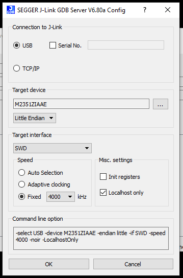

# Segger J-Link Debug Guide

The SEGGER J-Link is the recommended tool for debugging baremetal applications created using the Cascoda SDK. The SEGGER J-Link has good integration to [gdb](https://www.gnu.org/software/gdb/), using a 'GDB Server' program to bridge the hardware to the gdb tool.

Software Requirements:

- A version of GDB that supports the target (For Chili2, can be arm-none-eabi-gdb or gdb-multiarch). [See the development environment setup guide](development-setup.md).
- The latest [SEGGER J-Link Software & Documentation Pack](https://www.segger.com/downloads/jlink/)
- Can be run on Windows, macOS or Linux

Hardware Requirements:

- A suitable SEGGER J-Link
- An adapter from the 20-pin JTAG to 9-pin or 10-pin swd connector
- The target platform (This guide assumes Chili2D)

## Procedure

- Connect J-Link to Chili2D via debug adapter
- Power the Chili2D
- Connect the J-Link to the the host PC
- Run the SEGGER J-Link GDB Server
- Set the target device (M2351... For Chili2, NANO120... for Chili1)
- Set the target interface to SWD

<p align="center"></p>

- Click OK, the JLink should connect to the target
- Check the log presented, it should print the port (usually 2331).

```
Connecting to J-Link...
J-Link is connected.
Firmware: J-Link V10 compiled Jun  9 2020 13:38:07
Hardware: V10.10
S/N: xxxxxxxx
Feature(s): GDB
Checking target voltage...
Target voltage: 3.28 V
Listening on TCP/IP port 2331
Connecting to target...
Connected to target
Waiting for GDB connection...
```

- Start GDB in the build directory with the command (substitute arm-none-eabi-gdb with gdb-multiarch if necessary, and reference the target binary instead of mac-dongle)

```bash
arm-none-eabi-gdb -ex "target remote localhost:2331" bin/mac-dongle
```

- Use the ``monitor reset`` command to reset the target. Other useful commands:

| Command | Effect
| :------ | :-----
| load    | Download the binary onto device flash
| monitor reset | Reset and halt the target device
| c       | Continue a halted device
| b <loc> | Set a breakpoint at the location (can be function name, filename:linenum, and more)
| p <sym> | Print the value of a symbol (can also use other forms like p/x to print in hexadecimal)
| x <addr>| Examine the memory values at an address (can also use other forms like x/10xb to print 10 bytes in hex)

GDB is a very powerful tool, there are many guides on the internet that will provide more detail, including the [GDB documentation itself.](https://sourceware.org/gdb/current/onlinedocs/gdb/)

## Debugging with VSCode

Rather than use raw GDB to debug we can use VSCode builtin debugger. 
First install the [Cortex-Debug](https://marketplace.visualstudio.com/items?itemName=marus25.cortex-debug) extension. With this you can now create a debug configuration (launch.json). 

To use with the J-Link, this will look like:
```json
{
    // Use IntelliSense to learn about possible attributes.
    // Hover to view descriptions of existing attributes.
    // For more information, visit: https://go.microsoft.com/fwlink/?linkid=830387
    "version": "0.2.0",
    "configurations": [
        {
            "name": "Cortex Debug",
            "cwd": "${workspaceFolder}/working_directory",
            "executable": "./path/to/exe",
            "request": "launch", #or attach
            "type": "cortex-debug",
            "serverpath": "C:\\Path\\To\\JLink\\JLinkGDBServerCL.exe",
            "runToEntryPoint": "main",
            "servertype": "jlink",
            "device": "M2351KIAAE", #processor for Chili2D
            "interface": "swd",
        }
    ]
}
```

To use with OpenOCD, this will look like:
```json
{
    // Use IntelliSense to learn about possible attributes.
    // Hover to view descriptions of existing attributes.
    // For more information, visit: https://go.microsoft.com/fwlink/?linkid=830387
    "version": "0.2.0",
    "configurations": [
        {
            "name": "Cortex Debug",
            "cwd": "${workspaceRoot}",
            "executable": "./path/to/exe",
            // "request": "launch",
            "request": "attach",
            "serverpath": "C:\\Path\\To\\OpenOCD-Nuvoton\\src\\openocd.exe",
            "type": "cortex-debug",
            "servertype": "external", //NOTE: this means you will have to start the server manually
            "device": "M2351KIAAE",
            "configFiles": [
                "interface/nulink.cfg",
                "target/numicroM23.cfg"
            ],
            "gdbTarget": "localhost:3335",
            "searchDir": [
                "C:\\Path\\To\\OpenOCD-Nuvoton\\tcl"
            ],
        }
    ]
}
```

You should now be able to debug within VSCode and step through code interactively.