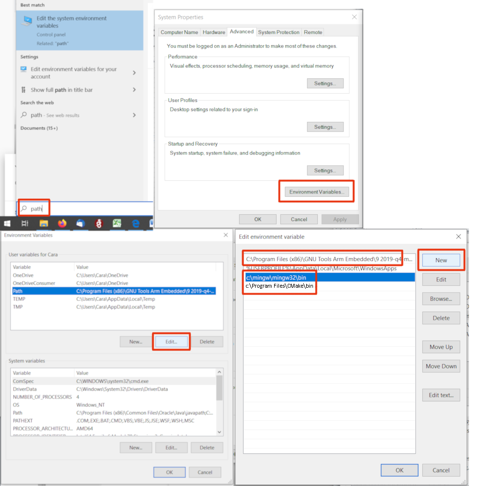

# Development Environment Setup

To develop with the Cascoda SDK, the development environment must be set up. This is easier on Linux systems and macOS systems, but is also possible on Windows. The core components for development are fairly standard, and based on the GCC toolchain:

| Component         | Description                                                          |
| ----------------- | -------------------------------------------------------------------- |
| gcc/g++           | Compiler for native builds                                           |
| cmake             | Build system tool for generating & managing build configurations     |
| make              | Build tool to execute the cmake-generated builds                     |
| arm-none-eabi-gcc | Compiler for Chili platform (and other embedded arm devices)         |
| git               | Version Control System for getting latest Cascoda SDK                |
| gdb               | Debugger for analysing executing programs                            |
| clang-tidy        | Static analyser for detecting common code problems                   |
| clang-format      | Code formatter for consistent code styling                           |
| doxygen           | Code documentation tool for generating HTML docs describing code     |
| plantuml          | Diagram generation tool for generating UML diagrams in documentation |

Version Requirements:
- CMake must be version 3.13 or newer.
- clang-format must be version 6.0

It is possible to use alternative tools such as ninja instead of make, or clang instead of gcc, but that is out of scope of this document.

## Linux

On a recent Debian/Ubuntu distro, you can set up the required development environment with:

```bash
sudo apt install git cmake cmake-curses-gui gcc g++ gcc-arm-none-eabi gdb-multiarch build-essential clang-format-6.0 make libhidapi-dev
#optional
sudo apt install clang-tidy-8 doxygen graphviz ninja-build default-jre
```

Also optionally download the [plantuml jar](https://plantuml.com/download)

## macOS

Using [Homebrew](https://brew.sh/), you can set up the required development environment with:

```bash
brew tap ArmMbed/homebrew-formulae
brew install git cmake gcc g++ arm-none-eabi-gcc llvm@6 make hidapi
#optional
brew install doxygen graphviz ninja openjdk
```

Also optionally download the [plantuml jar](https://plantuml.com/download)

## Windows

Install:
- [git](https://gitforwindows.org/) (Add git to PATH when prompted)
- [CMake](https://cmake.org/download/)
- [mingw-w64](https://sourceforge.net/projects/mingw-w64/)
- [arm-none-eabi-gcc](https://developer.arm.com/tools-and-software/open-source-software/developer-tools/gnu-toolchain/gnu-rm/downloads)

Note that if git was installed without adding to the PATH, then the build system will not be able to detect the version and will display 'unknown'. Add the git `cmd` directory to PATH using the same method as below to solve this.

Make sure the mingw ``bin`` directory and the arm-none-eabi-gcc ``bin`` directory are added to your PATH environment variable. To add to path, take note of the installation directory during the install process. Then after installation:

1. Open the start menu and search for 'path'
2. Click on 'Edit the system environment variables'
3. In the window that opens up, click the 'Environment Variables' button.
4. Select the 'Path' variable in either the 'User variables' (for current user) or 'System variables' (for all users)
5. Click the corresponding 'Edit' button
6. Use the 'New' button to add the mingw and arm-none-eabi-gcc ``bin`` directories.
7. Click 'OK' and exit

<p align="center"></p>

Optionally install:
- [JRE](https://java.com/en/download/)
- [PlantUML](https://plantuml.com/download)
- [clang-tidy and clang format (download v6.0.1)](https://releases.llvm.org/download.html)
- [Doxygen](https://www.doxygen.nl/download.html)
- [Graphviz](https://graphviz.org/download/)
