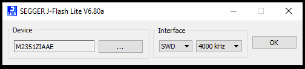
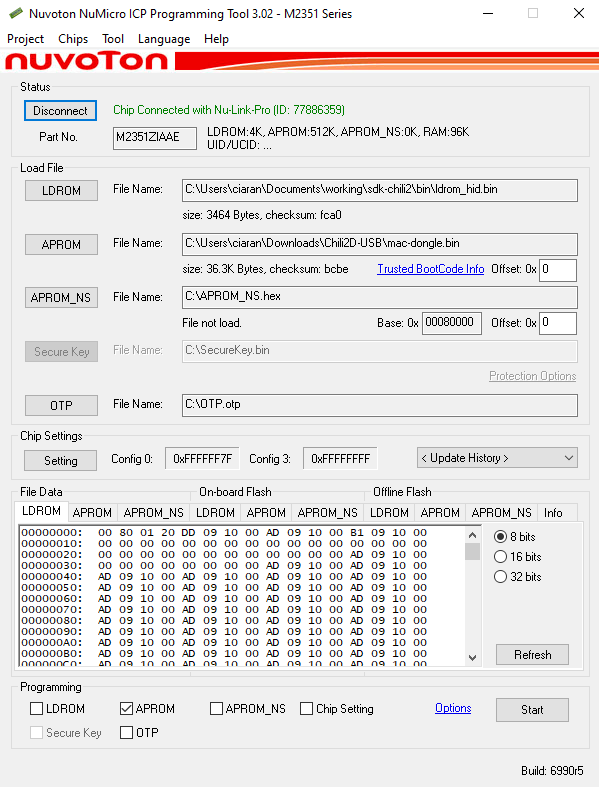

# Flashing Guide

For flashing binaries built for embedded targets, or downloaded from the [GitHub releases page](https://github.com/Cascoda/cascoda-sdk/releases) there are multiple approaches.

1. Using a [SEGGER J-Link](https://www.segger.com/products/debug-probes/j-link/)
2. Using a [Nu-Link Pro](https://direct.nuvoton.com/en/nu-link-pro)

For flashing the Chili 2D with TrustZone (CSME) binaries, please refer to the [TrustZone development guide](M2351-TrustZone-development-guide.md#flashing-trustzone). This guide is only for non-TrustZone binaries.

** Warning: If a device has previously been flashed with a TrustZone binary, it must be fully erased using the Nu-Link Pro and the ICP tool. **

## SEGGER J-Link

_Note that when using the SEGGER J-Link, it is also possible to [flash and debug from GDB.](debug-with-segger-jlink.md)_

The SEGGER J-Link in combination with J-Flash Lite can be used to simply flash a device with a given binary.

Software Requirements:

- The latest [SEGGER J-Link Software & Documentation Pack](https://www.segger.com/downloads/jlink/)
- Can be run on Windows, macOS or Linux

Hardware Requirements:

- A suitable SEGGER J-Link
- An adapter from the 20-pin JTAG to 9-pin or 10-pin swd connector
- The target platform (This guide assumes Chili2D)

### Procedure

- Connect J-Link to Chili2D via debug adapter
- Power the Chili2D
- Connect the J-Link to the the host PC
- Run the SEGGER J-Link GDB Server
- Set the target device (M2351... For Chili2, NANO120... for Chili1)
- Set the target interface to SWD
- Click OK

- Browse to the desired binary file using the [...] button, and then click 'Program Device'.
- Verify that there are no errors in the Log pane

## Nu-Link Pro

The Nu-Link Pro in combination with the Nuvoton ICP programming tool can be used to flash a device, change chip settings and fully factory erase a device.

Software Requirements:

- The latest [Nuvoton ICP programming tool](https://www.nuvoton.com/tool-and-software/software-development-tool/programmer/)
- Can only be run on Windows

Hardware Requirements:

- A [Nu-Link Pro](https://direct.nuvoton.com/en/nu-link-pro)
- An adapter from the NuLink to 9-pin or 10-pin swd connector (Can be wired into jlink adapter or contact us to obtain one)
- The target platform (This guide assumes Chili2D)

### Procedure

- Connect the Nu-Link Pro to the Chili2D via debug adapter
- Do NOT power the Chili2D (It is powered by the Nu-Link Pro)
- Start the Nuvoton NuMicro Programming Tool
- Select M2351 Series target chip
- Click 'Connect' to connect to M2351
- Click the 'APROM' button to browse to the APROM binary file
- Ensure that only the 'APROM' checkbox is selected
- Click 'Start' to program the device

