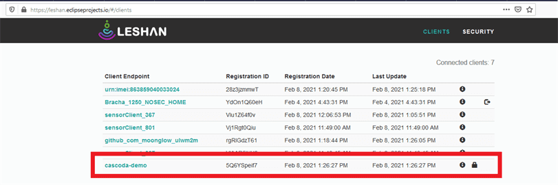
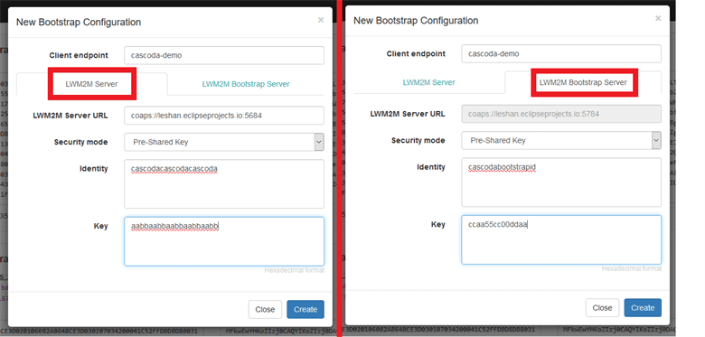

# LWM2M over Thread

This guide will provide an overview for the evaluation of the LWM2M stack that has been integrated into the Cascoda SDK.
The Cascoda SDK includes the [Wakaama](https://github.com/eclipse/wakaama) LWM2M stack and a port layer that allows it
to run inside the Cascoda SDK with OpenThread. This is provided as a proof of concept.

Further information about LWM2M can be found in the [LWM2M Core Specification](http://www.openmobilealliance.org/release/LightweightM2M/V1_1-20180710-A/OMA-TS-LightweightM2M_Core-V1_1-20180710-A.pdf)
and the [LWM2M Transport Specification](http://www.openmobilealliance.org/release/LightweightM2M/V1_1-20180710-A/OMA-TS-LightweightM2M_Transport-V1_1-20180710-A.pdf).

The Wakaama stack is located in ``third-party/``. The port and example code are in ``baremetal/app/ot-cli-lwm2m``.

## Demo network

This evaluation guide demonstrates the process of connecting a LWM2M Client, running on a Thread Node on a Thread
network, to a LWM2M Server. The LWM2M Server can be running on the adjacent local network, or the Internet. A Thread
Border Router facilitates the communication between the Thread Network and the local network/Internet.

## Setup

### Build

The SDK should be configured for the Chili2 as outlined in the [main readme](../../README.md#instructions).
The CMake configuration ``CASCODA_BUILD_SECURE_LWM2M`` should be set to ``ON``, by using the 
``-DCASCODA_BUILD_SECURE_LWM2M=ON`` argument to CMake, or using the ``ccmake`` or ``cmake-gui`` configuration tools. This
will cause LWM2M to be built with the CoAP over DTLS transport binding.

Then the ``ot-cli-lwm2m`` target should be built again, to apply the config.

_Note: LWM2M does work without security, but this guide does not cover it. Simply omit the security parameters if 
evaluation of non-secure communication is desired._

### Flash

The ``ot-cli-lwm2m`` binary must be flashed to the Chili2D. See [the flashing guide](flashing.md) for information on how
to flash. The CLI of the flashed firmware can be accessed using the 'serial-adapter' tool on the host system.

### Form network

Set up a [border router](border-router-setup.md), and form a Thread network. 

### Commission client

[Commission](thread-commissioning.md) the ``ot-cli-lwm2m`` device onto the network.

### Test connectivity

Test connectivity to your server using the built in ``ping`` command. Note that the ``ping`` command doesn't do hostname
resolution or NAT64 automatically, so ping the IPv6 of your local server directly, or a well known public IP (using NAT64 notation if not native IPv6).

```
# Local server
> ping fdaa:bbcc:ddee:0:a196:ec9a:66bc:f69
16 bytes from fdaa:bbcc:ddee:0:a196:ec9a:66bc:f69: icmp_seq=2524 hlim=63 time=45ms
# Well known NAT64 (cloudflare DNS)
> ping 64:ff9b::1.1.1.1
16 bytes from 64:ff9b:0:0:0:0:101:101: icmp_seq=2526 hlim=58 time=47ms
```

## Evaluating LWM2M Server on Internet

To test Wakaama without setting up a local server, the publicly hosted [Leshan](https://github.com/eclipse/leshan)
server and bootstrap server can be used. Leshan is an open-source LWM2M stack, written in Java.

The publicly hosted Leshan server is IPv4 only, but the Thread Border Router runs a [NAT64](https://en.wikipedia.org/wiki/NAT64)
service to facilitate communication from the IPv6-only Thread network to the IPv4-only server. The Thread node carries
out [DNS64](https://tools.ietf.org/html/rfc6147) locally in order to obtain the suitable NAT64 IPv6 address of the server.

The URL of the example Leshan LWM2M server is ``coaps://leshan.eclipseprojects.io:5684``, and the web interface is hosted
at https://leshan.eclipseprojects.io/. The URL of the example Leshan bootstrap server is 
``coaps://leshan.eclipseprojects.io:5784`` and the web interface is hosted at https://leshan.eclipseprojects.io/bs/.
(This information is from the readme at https://github.com/eclipse/leshan#test-server-sandbox).

### Without Bootstrapping

It is possible to directly connect to a LWM2M server without a bootstrap server, in what would be a 'factory bootstrap'.
In the context of this evaluation, this means that the LWM2M server information will be directly provided to the client
using the CLI.

To begin, the security credentials must be configured on the server. For this demo, 'Pre-Shared Key' authentication will
be used. The credentials must be added on the 'Security' tab of Leshan. Select 'Add new client security configuration',
and enter the client endpoint name, security mode, identity and key. For multiple clients, each client must have unique
values.


Now on the commissioned and attached Thread node, the LWM2M client must be started, using the same endpoint name, identity
and key as configured on the server. The ``lwstart`` command is used for this. Further documentation can be found in the
[client documentation](../../baremetal/app/ot-cli-lwm2m/README.md).

```
> state
router
Done
> lwstart -n cascoda-demo -h leshan.eclipseprojects.io -i cascodacascodacascoda -s aabbaabbaabbaabbaabb
LWM2M Client "cascoda-demo" started on port 0
Rx:  -> State: STATE_REGISTERING
Rx:  -> State: STATE_REGISTERING
Rx:  -> State: STATE_READY
```

It will take a few seconds to complete the registration process. When the registration is complete, the client should be
visible in the client list of the server. The padlock indicates that the connection is secured with DTLS.



By clicking on the client endpoint name, it is possible to view the list of objects that the client is advertising, and
interact with them, using the 'read', 'write', 'observe' and 'execute' actions.


### With Bootstrapping

Bootstrapping is an additional configuration step that is possible before registration to a LWM2M server. A client can be
'bootstrapped' by contacting a bootstrap server, which will configure the parameters for the LWM2M server that the client
should register to. The bootstrap server can also configure other parameters on the client.

The Leshan bootstrap server must be configured with the security parameters of the client, and the security parameters 
that the client should use to register to the server. Using the Leshan bootstrap server, the "Add new client bootstrap 
configuration" button should be used, and the details on both tabs must then be filled out.

The credentials that the client should use to connect to the bootstrap server should be entered on the "LWM2M Bootstrap
Server" tab. The credentials that the client should use to connect to the LWM2M server should be entered on the "LWM2M
Server" tab.



If the LWM2M client is already registered to a LWM2M server, this must first be undone by either resetting the node, or
using the ``lwstop`` command to stop the client. The LWM2M part of the demo doesn't persist any storage across reset, so
``reset`` will cause a clean start.

```
>reset
2021-02-08 13:45:42.408 WARN:  Hid device dropped... attempting reload
Rx: 1ms NOTE: EVBME connected, ot-cli-lwm2m, v0.15-140-g759658d6 Feb  5 2021
Rx: 2ms NOTE: Device ID: fb466895c80a4e72
> ifconfig up
Done
> thread start
Done
> state
child
Done
```

With the Thread node now joined to the network, the LWM2M client can be started, using the ``-b`` flag to enable
bootstrapping. The arguments are documented in more detail in the [client documentation](../../baremetal/app/ot-cli-lwm2m/README.md).

```
> lwstart -n cascoda-demo -h leshan.eclipseprojects.io -b -p 5784 -i cascodabootstrapid -s ccaa55cc00ddaa
LWM2M Client "cascoda-demo" started on port 0
> Rx:  -> State: STATE_BOOTSTRAPPING
[BOOTSTRAP] backup security and server objects
Rx:  -> State: STATE_BOOTSTRAPPING
Rx:  -> State: STATE_BOOTSTRAPPING
Rx:  -> State: STATE_REGISTERING
Rx:  -> State: STATE_REGISTERING
Rx:  -> State: STATE_READY
```

After a short delay, the client will begin the bootstrapping process, be bootstrapped with the fresh credentials, and
then disconnect from the bootstrap server and form a secure connection with the LWM2M server. It will register, and then
be visible and controllable by the server, as described in the previous section.

## Evaluating LWM2M Server on LAN

An alternative to using the publicly hosted Leshan server is to host Leshan locally. It is possible to host a leshan
server (and bootstrap server) on the Local network, and connect to it directly using the IP address from Thread. This can
be used to test IPv6-only communication, or a custom server build.

The Leshan server and bootstrap server can be found on the [Leshan GitHub](https://github.com/eclipse/leshan). The GitHub
has instructions on how to build the server, or alternatively provides links to prebuilt versions.

Note that when starting the servers, **it is important to bind it to a single IP address**, as a normal system will have
multiple IPv6 addresses. For most servers, it makes sense to bind to the permanent IPv6 address, not a temporary one
(see [RFC4941](https://tools.ietf.org/html/rfc4941)).

Starting the server, default ports for coap and web UI:
```bash
java -jar ./leshan-server-demo.jar -lh fdaa:bbcc:ddee:0:a196:ec9a:66bc:f69 -slh fdaa:bbcc:ddee:0:a196:ec9a:66bc:f69
```

Starting the bootstrap server, with web UI hosted on port 8081 instead of 8080, and using ports 5783 and 5784 for coap:
```bash
java -jar .\leshan-bsserver-demo.jar -lh fdaa:bbcc:ddee:0:a196:ec9a:66bc:f69 -lp 5783 -slh fdaa:bbcc:ddee:0:a196:ec9a:66bc:f69 -slp 5784 -wp 8081
```

Note that when using IPv6 addresses directly in URIs, it is important to use correct notation, with the IP address in
square brackets, such as ``coaps://[fdaa:bbcc:ddee:0:a196:ec9a:66bc:f69]:5684``.

Otherwise, the procedure is the same as the public Leshan servers.

## Considerations

Wakaama functionality is not guaranteed, and the Wakaama project is in active development. If there are issues with the
connectivity port, these can be reported to Cascoda, but issues with the core Wakaama stack are better reported to the
[Wakaama Github](https://github.com/eclipse/wakaama).

LWM2M, DTLS and CoAP runs on top of UDP. As UDP is 'connectionless', stateful firewalls and NAT gateways more aggressively
delete connection information. A symptom of this is that the LWM2M server may not be able to contact the client after a
period of no communication. This typically requires around 5 minutes of no packets. In order to defeat this, there are 
potential workarounds:

1. Ensure regular communication with the client - by regularly reading a resource, for instance.
2. Decrease the server object 'lifetime' parameter, to cause more regular communication from the client to the server.
3. Use LWM2M 'Queue Mode', so that periods of inactivity are acceptable, and messages are extracted from the server when
the client updates its registration.
   
If the example client fails to update its registration, it will revert to bootstrap mode. This may not be desirable,
especially if there is no bootstrap server being used, so in a real application this must be caught by the application.

The 'Firmware' and 'Location' objects are unimplemented, and are just provided as examples. The test object 31024 is
unimplemented by Leshan, so doesn't provide much use. 

The example client does not store any LWM2M information in nonvolatile storage, so a reboot causes all registration
information to be lost.

The example client includes [additional documentation](../../baremetal/app/ot-cli-lwm2m/README.md) for further evaluation.

---
_Copyright (c) 2021 Cascoda Ltd._
