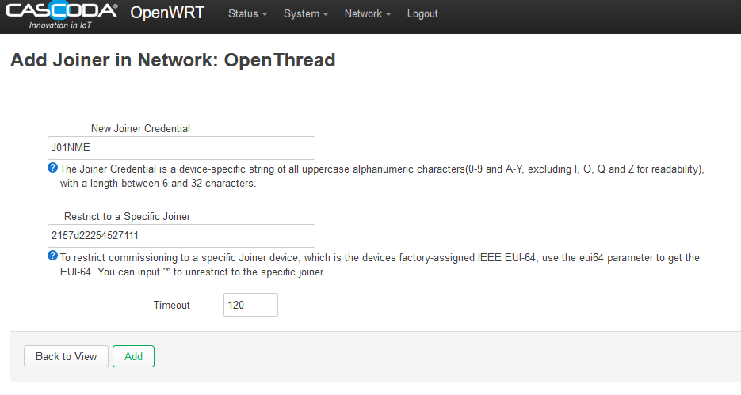

# Thread Commissioning Guide #

This is a practical guide for adding new Thread Devices to a Thread Network for the first time. It includes an overview of the commissioning process - more detail can be found in the [Thread Group Commissioning White Paper](https://www.threadgroup.org/support#Whitepapers) and the [Thread Specification](https://www.threadgroup.org/support#specifications).

## What is Commissioning

In a Thread network, all communication is secured by a network-wide key. Without that key, a device cannot participate in the network. The network also has other parameters that must be consistent and can be configured, such as the extended PAN ID, admin password, channel and network name.

In Thread, the Commissioner is the user-controlled admin interface to the Thread network. The primary purpose of the Commissioner is to add new devices to the network by securely provisioning them with the network credentials. It can also be used to modify the network parameters safely after the network is formed. Multiple commissioners can control a Thread Network, but only one can be active at a time.

A Commissioner can take many forms, such as:
- An application on a smartphone connected to the same WiFi network.
- A web GUI hosted on a Border Router.
- A UI on a Thread Device itself.
- A cloud service.

But the general principles are the same. On a high level, the process is:
1. The Commissioner forms a secure connection to the Thread Network (Using the Admin Password if not already on the Thread Network).
2. The Commissioner is provided the credentials for the new device (The EUI64 address, and Joiner Credential).
    - For a product, this is usually by scanning a QR code on the device, but details can also be entered manually.
    - The EUI64 address is propagated through the network.
      - This allows joining devices to search for the network that is expecting them.
    - The Joiner Credential is held by the Commissioner, and is used to establish a secure commissioning session with the joiner.
3. The joining device "discovers" the nearby network, and attempts to join the network(s) which are expecting it.
4. The Commissioner authenticates the joiner using the Joining Device Credential and, if successful, the joiner is provided with the Thread Network Credentials.

The network credentials are stored in non-volatile storage of the device, so Commissioning is only necessary the very first time a device joins the network. If power is lost, the device is reset or otherwise loses connection temporarily, the Thread device can simply rejoin the network with the automatic 'attach' process.

## How to Commission with the Cascoda SDK

In the Cascoda-SDK, there are many ways to perform the joining/commissioning procedure, based on the capabilities of the device. These can be used together in any combination - select one commissioning method and one joining method. It should be noted that a network must be formed either via the [OpenThread CLI](https://github.com/Cascoda/openthread/blob/master/src/cli/README_DATASET.md#form-network) or the [OpenThread Web GUI](border-router-setup.md), before commissioning can take place. A guide on how to do both is available [here](thread-network-formation.md).

Note that the commissioning and joining procedures happen in parallel, with the commissioner being provided with the joiner credentials just before the joiner starts discovering the network.

Select one commissioning method and one joining method:

- [Commissioning](#commissioning)
    - [CLI Commissioning](#cli-commissioning)
      - This can be used when you are using an openthread CLI on a device that is already connected to the network (or has formed it).
    - [App Commissioning](#app-commissioning)
      - This can be used when you have a border router, and an android smartphone that you can connect to it over WiFi.
    - [OT-BR Web GUI Commissioning](#ot-br-web-gui-commissioning)
      - This can be used when you have a border router and can access its web interface using a web browser.
- [Joining](#joining)
    - [CLI Joining](#cli-joining)
      - This is used when the joining device has an openthread CLI interface.
    - [Automatic Joining](#automatic-joining)
      - This is used for example applications that do not have openthread CLI interfaces.

### Commissioning

#### CLI Commissioning

CLI Commissioning uses the OpenThread CLI of a device already on the network in order to commission another device. It is useful for development purposes and testing.

- Connect to the CLI of the device, such as by using ``serial-adapter`` if using the [on module architecture](../reference/system-architecture.md).
- The Commissioner device must be already connected to the desired network.
    - The ``state`` command can be used to test this - output should be ``child``, ``router`` or ``leader``.
- Run the ``commissioner start`` command.
    - The device will attempt to become the active commissioner.
- Obtain the EUI64 and Joiner Credential of the device that will join the network. Instructions on how to do this are available in any of the joining procedures described further down this document. However, note that at this point in the commissioning process, you only want to extract the credentials, and you should NOT start the joining process yet. 
- Run the ``commissioner joiner add <eui64> <cred>`` command, with the obtained EUI64 and Joiner Credential from the previous step.
    - This adds the joiner as an authorised joining device.
- At this point, you are finally ready to start the joining process. To do that, go back to the joining procedure of your choice and continue from where you had left off after having extracted the EUI64 and Joiner Credentials.
- Wait for the process to complete...

- Device has been commissioned onto the network!

#### App Commissioning

The App Commissioning process uses the official Thread Commissioning app in order to provide the most user-friendly method of commissioning. The source code of the Thread Commissioning app is available to members of the Thread Group, so it is possible to develop custom versions.

- Download the [Thread Commissioning App](https://play.google.com/store/apps/details?id=org.threadgroup.commissioner) from the Google Play Store.
- Connect to the same network as a Thread Border Router using WiFi.
    - _(Some Border Routers offer their own WiFi APs which can be used, however the Cascoda demonstration BR does not by default. Connecting the Cascoda BR to your home router by Ethernet will allow commissioning over WiFi, however.)_
- Open the Thread Commissioning App and wait a few seconds for Border Routers on the network to be discovered.
- Select a Border Router with the correct network name (CascodaDemo in our case), and select it.
- Enter the admin password when prompted (123456 is the default for ot-br, we used 'netpass' - for a real network use a secure password!)

- Use one of the joining procedures below to obtain the joiner credentials.
- The Thread Commissioning application will present you with a camera window to scan a QR Code.
    - The QR Code is a simple text string in the format ``v=1&&eui=0000b57fffe15d68&&cc=J01NU5``
    - Any text QR Code generator can be used (including online QR generators).
- OR The credentials can be entered manually using the  _ENTER JOIN PASSPHRASE MANUALLY_  button.
    - Make sure that the credentials are correct!

- Press 'Confirm', and the commissioning process should begin.
- At this point, turn on the new device (or start the joining process using the CLI).
- Wait for the process to complete...

- Device has been commissioned onto the network!

#### OT-BR Web GUI Commissioning

The OT-BR Commissioning process uses the Openthread Border Router web portal to add a new device to the network.
It provides an example for how a production border router might allow a customer to add devices to the Thread Network.

- Open the ot-br GUI hosted at the local IP address of the border router, port 80.
- Navigate to the 'Commission' tab.
- Use one of the joining procedures below to obtain the joiner credentials.
- Enter the Network Passphrase/Admin Password and the Joiner Credential
    - Note that the EUI64 is not required for this commissioning method. This is less reliable as the joining device will not be directed to the correct network.
- Click  _START COMMISSION_ , and the commissioning process should begin.
- At this point, turn on the new device (or start the joining process using the CLI).
- Wait for the process to complete...

- Device has been commissioned onto the network!

##### Known issues

The Web GUI can sometimes lock up or crash, returning 'Join Success' even though the joining process has failed. As a workaround,
the web gui can be restarted from the raspberry pi terminal using the command ``sudo systemctl restart otbr-web.service``.

The Web GUI does not utilise the EUI64 of the joining device, and therefore does not set the commissioner 'steering data'.
This does not pose a problem if only a single device nearby is attempting to join a Thread network, but can lead to wasted
joining attempts if devices try to join the incorrect network.

### Joining

#### CLI Joining

CLI Joining uses the OpenThread CLI in order to join a device to the network. It is useful for development purposes and testing.

- Connect to the CLI of the device, such as by using ``serial-adapter`` if using the [on module architecture](../reference/system-architecture.md).
- The Joiner device should not be connected to a network - use ``factoryreset`` command to wipe all persistent storage and forget network info.
- Run the ``ifconfig up`` command.
    - This brings up the network interface and initialises the CA-8211.
- Use the ``eui64`` command to obtain the device eui64.
- The Joiner Credential can be whatever you like for CLI joining (6-32 characters), as it is manually specified in the next stage.
- If you've come to this section from the CLI Commissioning guide above telling you to extract the EUI64 and Joiner Credential, go back up with those two pieces of information, and continue from where you left off. You will be told when to come back to this section to start the joining process. Otherwise, **start the commissioner using one of the above methods.**
- After having added the joiner as an authorised device with the commissioner, start the joiner using the ``joiner start <cred>`` command.
    - This command takes some time to run, and returns ``Join success`` on success, or ``Join failed`` upon an error.
- Run the ``thread start`` command after join success to join the Thread Network!
    - The ``state`` command can be used to check that the device correctly joined the network as a ``child`` or ``router``.

- Device has joined the network!

#### Automatic Joining 

Automatic Joining is used with some of the demos in the Cascoda SDK that do not have openthread CLI interfaces, such as ``ot-sed-sensorif``. This kind of joining is suitable for real-world products, and sleepy devices that do not have a user interface.

In the case of our examples, we make use of the ``evbme-get`` utility to extract the credentials of the device. For real products, a label or other associated material would be more appropriate.

- Run the ``evbme-get`` utility.
    - This can be obtained by either:
      - Building the cascoda-sdk natively. 
      - Downloading Windows binaries from [Github](https://github.com/Cascoda/cascoda-sdk/releases).
- Connect the Chili device to the system.
    - This must be done  __after__  running the utility, otherwise the device will go back to sleep.
- ``evbme-get`` will print system information for the connected device.
    - Note the ``EVBME_OT_EUI64`` and ``EVBME_OT_JOINCRED`` parameters.

- At this point, **start the commissioner using one of the above methods** and the parameters for the device.
- The Chili can be power cycled now to speed up the joining process.
    - The Chili will attempt to join a network if it is not currently part of a network and either:
      - It has just been powered on.
      - OR It has been 30 seconds since the last join attempt.
- Wait until the commissioner confirms the device has been commissioned.
- The device will automatically attach to the network and begin operation!

#### Automatic Joining with Hardcoded Credentials

Using `CASCODA_OT_JOINER_CRED` it is possible to assign a hardcoded joiner credential to a device, eliminating the need to force full network credentials to devices that don’t have serial interfaces, which is useful for development purposes.
- Provide a joiner credential value to the CMake cache variable `CASCODA_OT_JOINER_CRED`.  Further details can be found in [CMake’s documentation](https://cmake.org/cmake/help/v3.19/manual/cmake.1.html#options).
- For modules that do not support a serial interface power cycling the device will cause it to attempt to join with the hardcoded credential.
- For modules that do support a serial interface, such as `ot-cli`:
    - Run the `ifconfig up` command.
    - Then run the `join` command.
        - Similar to above, it should take some time to run, and returns `Join success` on success, or `Join failed` upon an error.
