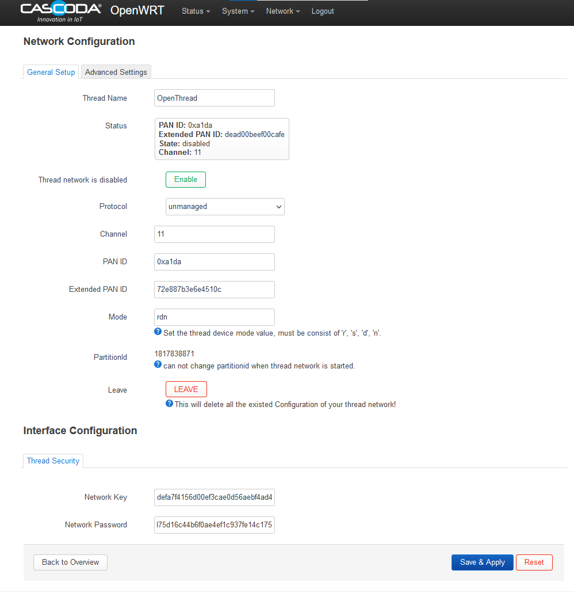

# Thread Network Formation Guide #

This is a practical guide for forming a Thread Network for the first time. It includes an overview of the forming process - more detail can be found in the [Thread Specification](https://www.threadgroup.org/support#specifications).

## What is Forming a Network?

The very first device on a Thread Network must 'Form' it, before any other nodes are able to join and participate in it.
The formation of a network includes selecting a network name and channel, setting the admin password (aka Network Passphrase or Commissioning Credential) generating a network key (aka master key), extended PANID and PANID. This then becomes the active operational dataset of the network, and is shared between every node participating in the network.

The form procedure only needs to be followed once for any given network. After the network is formed, additional nodes can join the network, and be provided with the active operational dataset by following [the commissioning process.](thread-commissioning.md) If the network parameters need to be changed, then a commissioner can be used in order to reconfigure the active dataset.

## How to form a network with the Cascoda SDK

In the Cascoda SDK, there are two possible mechanisms to form a network, depending on if the forming device is a Border Router or not.

1. If the forming device is a Border Router, then the network can be formed using the [Web UI.](#forming-a-network-using-the-or-br-web-ui)
2. If the forming device has an OpenThread CLI, then the network can be formed using the [Command Line.](#forming-a-network-using-the-openthread-cli)

After forming a network, new devices can be added to it by following [the commissioning process.](thread-commissioning.md)


### Forming a network using the OR-BR Web UI

The OT-BR Forming process uses the OpenThread Border Router web portal. It provides an example for how a production border router might allow a customer to form a new Thread Network.

1. Browse to the OpenThread border router web GUI, which is hosted at the local IP address of the border router, port 80
2. Navigate to the Form tab on the left hand side
3. Fill in the fields, choosing random values for Extended PAN ID, PAN ID and Network Key. The 'passphrase' field is the Commissioner Credential/Admin Password.

<p align="center"></p>

4. Click 'Form'

#### Known issues

The Web UI is a development tool, and forces the user to choose parameters (such as network key) which should be randomly generated.
This allows flexibility for development & debugging purposes, but should not be the case for real world border routers.

### Forming a network using the OpenThread CLI

To form a network using the OpenThread CLI, follow the following steps with a serial-adapter instance connected to an ot-cli instance, or with an ot-cli-posix-ftd running locally.

1. Make sure the device does not have any old network data

```
>factoryreset
```

2. Start Thread and generate a new dataset

```
> ifconfig up
Done

> dataset init new
Done

> dataset
Active Timestamp: 1
Channel: 16
Channel Mask: 07fff800
Ext PAN ID: 4c72b0a2d8ecd611
Mesh Local Prefix: fd34:74cd:ae4:1c3e/64
Master Key: 11ba68ecc258e4db3af612c2c73967ca
Network Name: OpenThread-7045
PAN ID: 0x7045
PSKc: 9bf4d7f0de6fa8d4b604d1a541f4894e
Security Policy: 0, onrcb
Done
```

3. (optional) At this point, any of the individual parameters can be modified if desired

```
> dataset help
help
active
activetimestamp
channel
channelmask
clear
commit
delay
extpanid
init
masterkey
meshlocalprefix
mgmtgetcommand
mgmtsetcommand
networkname
panid
pending
pendingtimestamp
pskc
securitypolicy
Done

> dataset networkname cascoda-net
Done

> dataset
Active Timestamp: 1
Channel: 16
Channel Mask: 07fff800
Ext PAN ID: 4c72b0a2d8ecd611
Mesh Local Prefix: fd34:74cd:ae4:1c3e/64
Master Key: 11ba68ecc258e4db3af612c2c73967ca
Network Name: cascoda-net
PAN ID: 0x7045
PSKc: 9bf4d7f0de6fa8d4b604d1a541f4894e
Security Policy: 0, onrcb
Done
```

4. Commit the dataset to active, then start the new network

```
> dataset commit active
Done

> thread start
Done
```

5. Wait a few seconds, and the network will be formed. This device will become the leader.

```
> state
leader
Done
```
