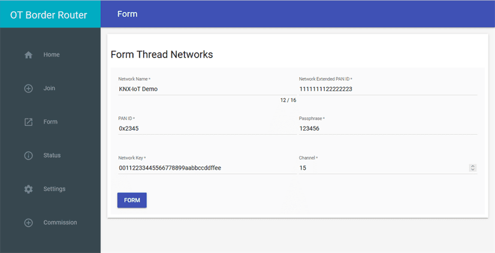
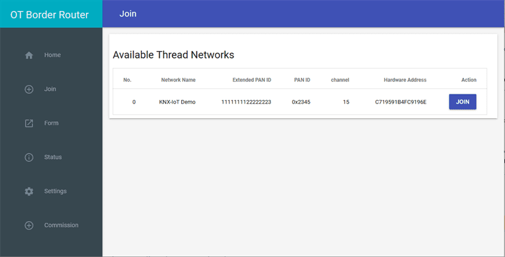
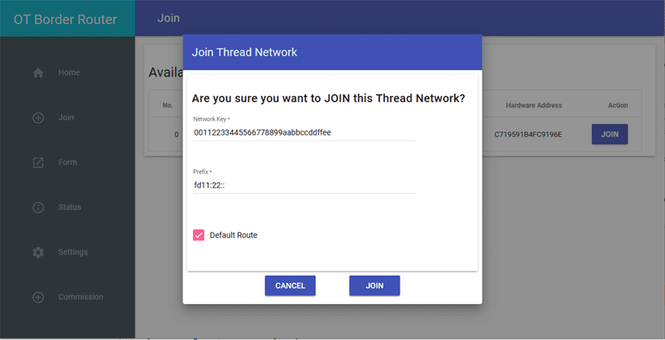
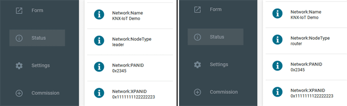
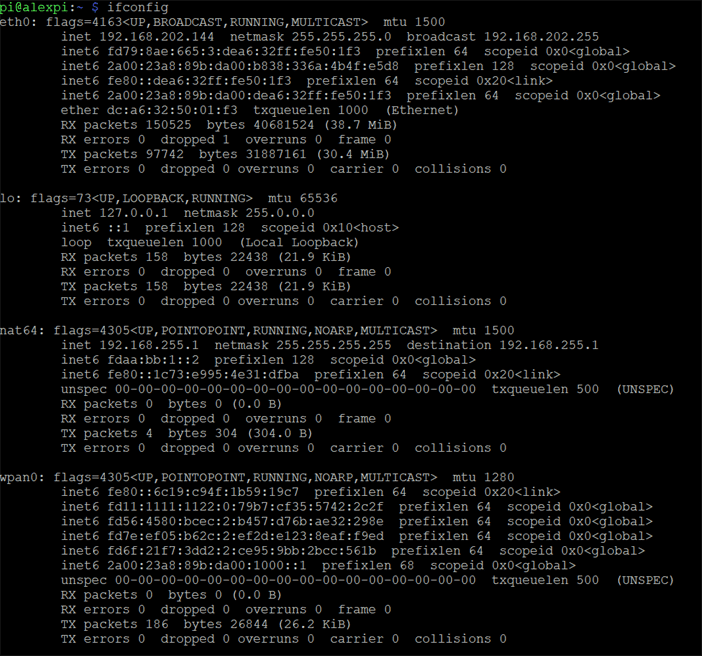
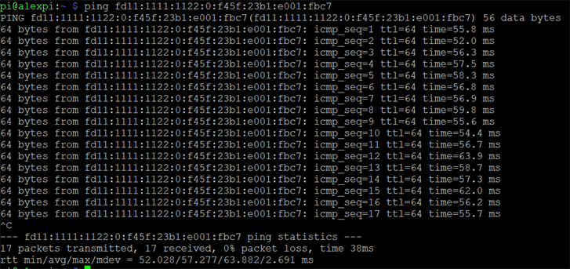

# Two Border Router Setup Guide

This guide describes how to set up two Cascoda Border Routers so that they live on the same Thread network. This enables them to use IPv6 to communicate over Thread, even if they are not connected to each other via Ethernet.

## Accessing the OT Border Router Web GUI

In order to access the Border Router Web GUI, you need to determine the IP addresses of the two Cascoda Border Routers. The addresses are displayed by the Cascoda Border Router whenever you login using SSH. Alternatively, you may connect a keyboard, monitor & mouse to the Cascoda Border Router, open a terminal and use the `ifconfig` command to see all IP addresses of that border router.

Once you have obtained an IP address, you can navigate to the border router GUI on the local network by typing `http://<ip-address>` into your browser's address bar.

## Network Configuration

### Step 1
On the first border router, you must form a Thread network. Use the menu on the left and navigate to the Form section. Please change the Network Name, PAN ID, Extended PAN ID & Network Key so as not to conflict with the details of the temporary network formed in the next step.

You will also need to write down the network key you have chosen, as it is needed by the second border router.

### Step 2
On the second border router, please form a network using the default credentials. This step is necessary so that the radio is able to discover networks within the Join tab.

Once the second border router has formed a network, navigate to the Join tab and wait for the network formed within Step 1 to be discovered. This may take a few attempts - to try again simply hit the Join button once more.

The screenshot below shows a successful network discovery: the Available Thread Networks list displays the network created in step 1.

### Step 3

Finally, once the network has been discovered, you must join this network. Please make sure you enter the network key you have written down during Step 1, as seen below.

## How do you know the Thread network is working?

Once the Join completes, you may check the Status tabs of the two border routers. They should both have the same Network Name, PANID & XPANID. One of the devices should have a NodeType of Leader, and the other one will either be a router or an end device.

Running the `ifconfig` command should show several IPv6 addresses under the `wpan0` interface - these are the Thread addresses of the border router, and they can be used by any IPv6 application in order to communicate over Thread.

The picture below shows an example output - your addresses will be different, but there should be a similar number of IPv6 addresses under the `wpan0` interface.

Finally, if you obtain a Thread IPv6 address from the second border router using `ifconfig`, you can use the `ping` utility to test bidirectional communication over Thread. Notably, pings to a Thread device will work _even if the devices are not connected via Ethernet_.
