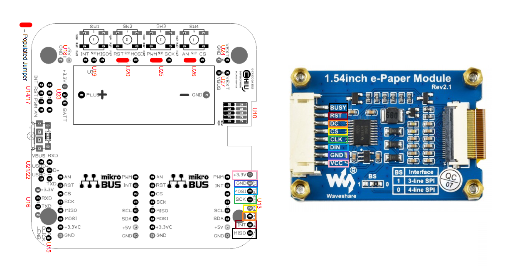
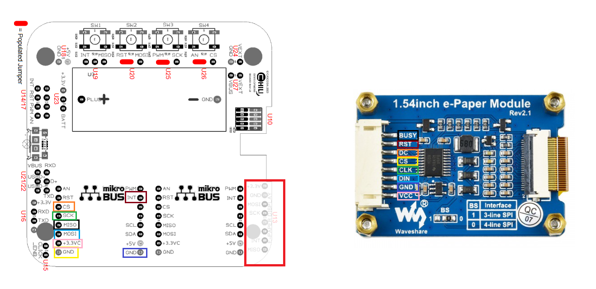

# Using an E-Paper Display with your KNX IoT DevBoard

This document will help you connect a supported e-paper display to your KNX IoT DevBoard.

## Requirements

- KNX IoT Development Board
- One of the supported E-Paper Displays
    - Waveshare 1.54 inch (Solomon Systech SSD1681 driver)
    - Waveshare 2.9 inch (Good Display IL3820 driver)
- 8-pin adapter to connect the pins of the E-Paper display to the Devboard.

## If the E-Paper specific interface is soldered on
The Devboard has conveniently-placed pins on the side, to make for an easy connection with the E-Paper display. However, the header is not soldered on by default. If you're able to solder a header on, then connect the E-Paper display as shown in the image below. *NOTE: The pin mapping is highlighted by the use of colored rectangles surrounding the corresponding pins*.

## If the E-Paper specific interface is not soldered on
Otherwise, you can still connect the E-Paper display, because all the required pins are made available elsewhere on the board. However, the end-result won't look as neat. In any case, please refer to the image below for how the connections are made.

