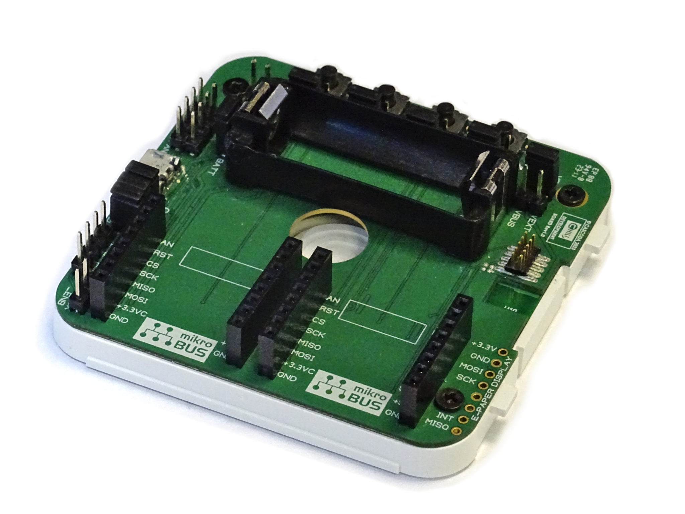

# Getting Started with the Cascoda Thread Development Board

## Overview
Cascoda's [Thread development board](https://www.cascoda.com/products/thread-development-kit/) provides everything you need to develop your Thread application with the Cascoda Chili module. It features Cascoda's SMARTRange™ technology to provide long-range Thread connectivity for whole-house coverage. In addition, Cascoda provides easy integration with Cascoda's dashboard and our [Border Router](https://www.cascoda.com/products/border-router/) for backhaul connectivity. 

The Thread development provides four programmable buttons and LEDs, and two MikroElektronika Click™ slots that allow easy plug-in of sensors and actuators. The Cascoda SDK has example applications designed specifically to demonstrate the features of the development board.

  

### Features
- Certified Thread-based radio supporting meshed networking, with long range
- Easy integration with Cascoda's Border Router for IPv4/IPv6 backhaul connectivity
- Ultra-low-power battery operation & battery charging
- Four programmable buttons & LEDs
- E-Paper display integration
- A library of sensor & actuator plug-in boards, to develop your solution
- Automatic code generation for your chosen target combination of sensors/actuators/switches/leds

### Specification
- USB or UART connectivity
- 5V or 3.3V supply options
- 3.7V Li/LiPo battery integration with charging from a 5V supply or USB
- Two Mikroelektronika Click™ slots for a huge range of plug-in sensor/actuator connectivity
- Integrated chip antenna and an externa antenna option
- Dimensions 66 x 64mm

  

## Get started with two examples
The Cascoda SDK provides [two example applications](../../baremetal/cascoda-bm-devboard/README.md) written specifically to demonstrate the features of the development board. Follow the steps below to try out either of these examples:

1. [Set up the environment and build system](../reference/full-reference.md#building).
2. Follow the [devboard-specific build instructions](../../baremetal/cascoda-bm-devboard/README.md#building-instructions) to generate the example binaries.
3. [Flash the devboard](../guides/flashing.md) with the either of the example binaries which were built in the previous steps (`devboard-blinky` or `devboard-click`), located in the `bin/devboard` folder of the build directory.

If you are running the `devboard-click` application, then you need to connect one or two MikroElektronika Click boards, and do the following:

4. Making sure the Chili device is connected to your Windows/Linux/MacOS machine, run the [serial-adapter](../../posix/app/serial-adapter/README.md) tool (`serial-adapter.exe` on Windows).
5. `serial-adapter` will now be displaying sensor values that are being read by the MikroElectronika sensors attached.
6. For more information about the MikroElektronika Click boards and how to connect them, see [this](../../baremetal/app/mikrosdk-bm/README.md). For information about which MikroElektronika Click boards are available, see [this](../../baremetal/mikrosdk-click/README.md).

If you are running the `devboard-blinky`, nothing else is needed and you can directly interact with the LEDs by pushing the buttons (the exact behaviour depends on how the application is written).

## KNX IoT
The above two examples get you acquainted with the process of building and flashing applications for the development board. Now, you can explore the KNX IoT applications available in the Cascoda SDK and run them on the development board. [Click here](../../knx-iot/README.md) for more information.

## Running Thread applications
You can explore the Thread applications available in the Cascoda SDK, and build and flash them in exactly the same manner. Note that you will need more than one device in order to run Thread applications, because networking is involved. [Here is a beginner-friendly guide to get started with Thread](howto-thread.md).

>Tip: Refer to the example source code for the development board in order to to get ideas of how to adapt the Thread applications provided by the Cascoda SDK so that they make use of the devboard's LEDs, buttons, and easy MikroElekronika Click board integration. 