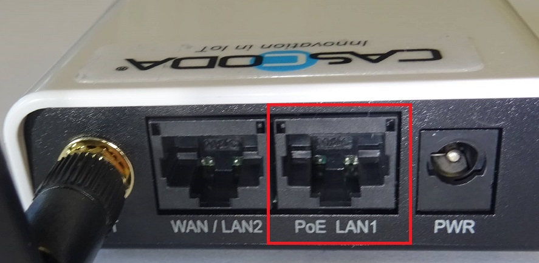
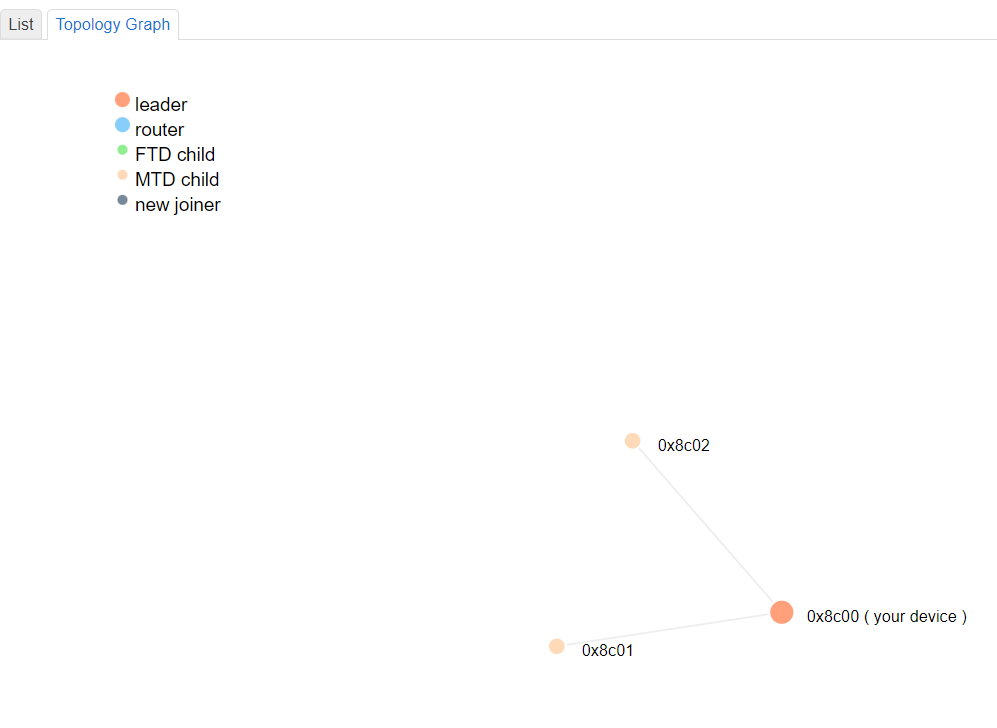

# KNX IoT Example Application - Getting Started Guide

This guide will get you up and running with your first KNX IoT application! No prior knowledge is needed, so all that is required is to have the correct hardware, and to follow the steps of the guide exactly as described.

## Step 0: Requirements

Please ensure you have the following hardware and software requirements before proceeding any futher.

### Hardware

- A pair of [Cascoda's KNX IoT Development Boards](https://www.cascoda.com/products/thread-development-kit/) (referred to as "devboards" from hereon).
- Two USB-A to micro-USB cables for the devboards.
- A [Cascoda KNX IoT Hub](https://www.cascoda.com/products/knx-iot-hub/) (referred to as "hub" from hereon).
- An antenna that comes with the hub.
- An Ethernet cable for the hub.
- A power adapter for the hub.
- A Windows PC.

### Software (on your Windows PC)

- An installation of [Cascoda's Windows Tools](https://github.com/Cascoda/cascoda-sdk/releases/download/v0.23-6/CascodaWindowsTools.zip). Two of the tools will be necessary for this guide, namely `chilictl.exe` and `serial-adapter.exe`.
- An installation of Cascoda's KNX IoT Linker.

## Step 1: Set up

1. Attach the antenna to the hub by screwing it in, then angle it upwards for maximum coverage.
2. Connect the hub to your Windows PC via Ethernet (the cable goes into the PoE LAN1 port).

<p align="center"></p>

3. Connect the hub to your internet router or switch via Ethernet, by connecting one end of the cable into the WAN/LAN2 port of the hub, and the other end of the cable into your internet router/switch.
4. Now power up the hub using the power adapter.
5. Connect the two devboards to your Windows PC via USB.

## Step 2: Create a Thread network

### Form a Thread network on the hub

1. Access the hub's Web GUI hosted on http://openwrt.local. Note: It takes 1 minute for the hub to start up after powerup. So the Web GUI won't be accessible until then.
2. If a login prompt comes up, just click OK, because the hub does not have a password by default.
3. Double check that you have internet access via the hub by opening up any web browser and searching something.
4. Now back to the hub's web GUI, you will see a menu bar at the top, hover over `Network`, and click on `Thread`.
5. Click on `Create`.
6. Scroll down to the bottom and click on `Save & Apply`. (If you have some Thread knowledge, feel free to change any of the fields to your liking before saving.)
7. Your Thread network should now be visible under `Network -> Thread`!

### Join the devboards to the Thread network

NOTE: This part of the guide will make use of the Cascoda Windows Tools that you have installed as part of the software requirements. By default, these tools are added to your `PATH`, enabling their execution in a shell in any directory. However, if this did not occur, you will only be able to execute the tools from within the directory in which they are installed. The default installation directory is `C:\Program Files (x86)\Cascoda Windows Tools`.

1. Open an instance of Windows PowerShell.
2. Type `chilictl.exe list`. If an error occurs, try prepending the path, e.g.
    ```powershell
    & 'C:\Program Files (x86)\Cascoda Windows Tools\chilictl.exe' list 
    ```
    If that still doesn't work, then it is likely that the Cascoda Windows Tools haven't been installed.
3. Information about both connected devboards should now be displayed on the screen in this fashion:
    ```
    PS C:\Users\Administrator> chilictl.exe list
    2023-05-25 12:40:32.502 NOTE:  Host Cascoda SDK v0.23-6-gefd3f47 May 22 2023
    Device Found:
            Device: Chili2
            App: knx_iot_example_240523_e730064
            Version: v0.23-6-gefd3f47
            Serial No: 82830D8702A7566B
            Path: \\?\hid#vid_0416&pid_5020#a&13e664b5&0&0000#{4d1e55b2-f16f-11cf-88cb-001111000030}
            Available: Yes
            External Flash Chip Available: Yes
    Device Found:
            Device: Chili2
            App: knx_iot_example_240523_e730064
            Version: v0.23-6-gefd3f47
            Serial No: 60F373F8446594E6
            Path: \\?\hid#vid_0416&pid_5020#a&235ac66c&0&0000#{4d1e55b2-f16f-11cf-88cb-001111000030}
            Available: Yes
            External Flash Chip Available: Yes
    ```
4. By default, your devboards will come pre-programmed with an application called `knx_iot_example_ddmmyy_xxxxxxx`. Each devboard also has a unique serial number. Copy and paste both serial numbers somewhere, as you will need them later. In our example here, the serial numbers are: 82830D8702A7566B and 60F373F8446594E6.
5. Now type `serial-adapter.exe` followed by one of the serial numbers, i.e. 
    ```
    PS C:\Users\Administrator> serial-adapter.exe 82830D8702A7566B
    ```
    This will open up a serial communication channel with that devboard. 
6. You should start seeing messages coming from the devboard via serial-adapter, getting displayed periodically. They will look something like this:
    ```
    PS C:\Users\Administrator> serial-adapter.exe 82830D8702A7566B
    2023-05-25 15:18:50.757 NOTE:  Host Cascoda SDK v0.23-6-gefd3f47 May 22 2023
    Rx: Trying to join Thread network...
    Rx: Thread Joining Credential: YR5XH9X3, EUI64: 6a56a702870d8382
    ```
    Keep this serial-adapter open for the time being.
7. Navigate to `Network -> Thread` in the hub web GUI.
8. Click on `View` on the side of the network formed by your hub.
9. Click on `Add` in the bottom right corner of the page. You will now see two input fields, one that says `New Joiner Credential` and one that says `Restrict to a Specific Joiner`.
10. From the serial-adapter output, copy the `Thread Joining Credential` (in this case YR5XH9X3) and paste it into the `New Joiner Credential` field, replacing the default text there. Likewise, copy the `EUI64` (in this case 6a56a702870d8382) from the serial-adapter output and paste it into the `Restrict to a Specific Joiner` field.
11. Click on `Add`.
12. Monitor the running serial-adapter output, which will show a lot of messages after about 10 to 30 seconds. If you see the following message, it means that the devboard successfully joined the network!
    ```
    Rx: Role: 2
    ```
    - **If the device does not join after two minutes, you may need to restart the Border Agent**. Please navigate to `System -> Startup`, scroll down until you find `otbr-agent`, then press Restart on the `otbr-agent` row. Afterwards, repeat steps 7 through 12 of this guide and the joining should be successful.
13. Among all the messages displayed, there is one message in particular that you have to find and copy-paste somewhere else, because it will be needed later in this guide. This message is called the "KNX QR code format", and looks something like this:
    ```
    Rx:  === QR Code: KNX:S:00fa10010710;P:4N6AFK6T83YWDUTW23U2 ===
    ```
    You may need to scroll up a little bit until you find this message. 
14. You may now terminate serial-adapter (this won't affect the devboard, it will only close the communication channel) by pressing Ctrl + C in PowerShell.
15. Repeat the exact same thing from step 5, but this time providing the serial number of the other devboard, in this case 60F373F8446594E6.
16. You should now have both devboards joined to the network formed by the hub.
17. Finally, verify that the devices are truly on the network, by looking at the network topology in the hub: Navigate to `Network -> Thread`, click on `View`, then `Topology Graph`. You should see something that looks like this (NOTE: this will only work if you've successfully connected to the internet via the hub): 

<p align="center"></p>

## Step 3: Configuring KNX devices

This can be done via [ETS](howto-knxiot-devkit_knx_tools.md) or via's [Cascoda's Linker](howto-knxiot-devkit_linker.md).
