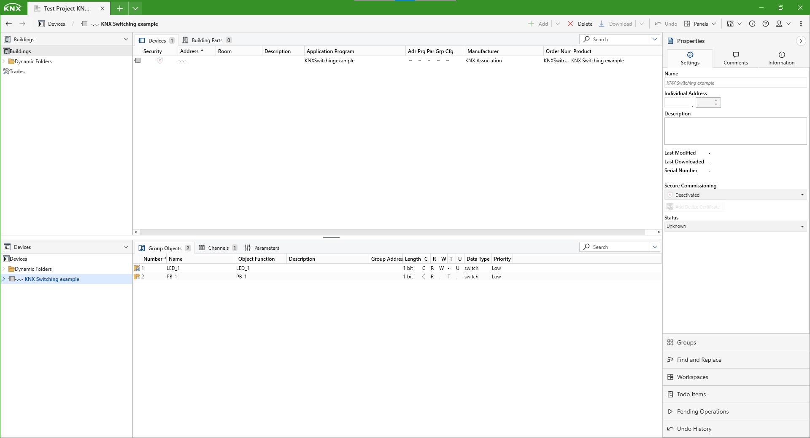
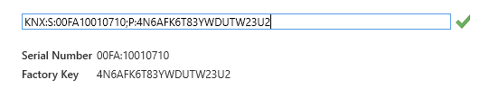
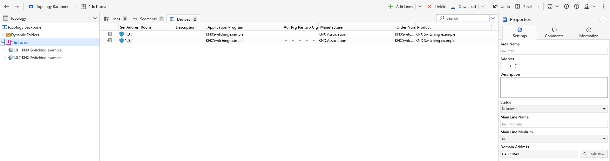
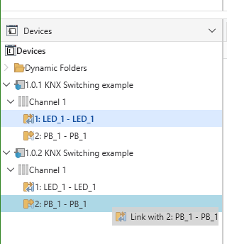
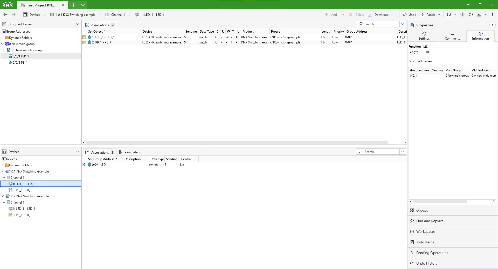

# KNX IoT - Getting Started Guide with ETS

This guide will help you configure your two development boards once they are on-boarded onto the same Thread network. By the end, you will be able to use a button on one devboard to control a light on the other.

## Step 0: Requirements

Please ensure you have the following hardware and software:

- ETS, version with KNX IoT enabled - ETS 6.1.1 build 5752 or later. A Beta version is available for KNX members.
- [Cascoda's KNX-IoT Development Kit](https://www.cascoda.com/products/thread-development-kit/). 
    - The factory binaries do not work with ETS builds later than 5886 - this is because the later builds implement version 1.1.0 of the Point API specifications, which is not backwards compatible. If you would like to use later builds of ETS, you must first update the binaries on the development board.

You also need to follow the [KNX IoT Getting Started Guide](howto-knxiot-devkit.md). You should have:
- A border router connected to your PC, accessible via Ethernet
- Devboards onboarded onto the Thread & visible on the Network Topology page

If you have no prior knowledge of using ETS, please create an account at [my.knx.org](https://my.knx.org/en/index) and complete the free ETS eCampus course before proceeding with this guide.

## Step 1: Import the Test Project into ETS

Download [the latest test project from the Cascoda GitHub.](https://github.com/Cascoda/knx_iot_example/tree/main/EXAMPLE/MT) and import it into ETS using the Import Project button on the Overview page. Then, open the newly-imported project.

## Step 2: Configure the two devices

Open the Devices panel by pressing the Panels button in the top left and selecting "Devices". You should now see "KNX Switching Example" device within the list of devices.

Select the KNX Switching example device, and navigate to Properties -> Settings. Here we see that Secure Commissioning is deactivated.

Please activate Secure Commissioning, set up a project password and then press Add Device Certificate. Please paste the KNX Device Certificate info of one of the devices into the popup window, and press OK. 

For our development boards, the KNX Device Certificate is printed within Serial Adapter. See the section in the [previous Getting Started guide](howto-knxiot-devkit.md) on getting the KNX QR code string.

Right click on the device inside the Devices panel and select Copy, and then right-click on the Devices button within the same panel and press Paste. Upon doing this, you will be prompted to enter the Device Certificate of this new device. Please paste the KNX Device Certificate of your second device and click OK.

## Step 3: Create an IoT area

Navigate to the Topology panel. Select the Topology Backbone and ensure that the Backbone Medium is set to IP. Press the Add Areas button create a new Area with Medium set to IoT. Then, drag and drop both devices into the newly created IoT area. The end result should look like this:

## Step 4: Configure the group communication

Open the Group Addresses panel, and Add a Main Group. Select the newly added Main Group, navigate to Properties->Settings and ensure Security is set to On. Then, fully expand both devices until you can see the LED_1 actuator and PB_1 sensor functional blocks for both devices. Drag-and-drop the LED_1 functional block of the first device onto the PB_1 block of the second device.

This will create an association within the main group you have just created, allowing that LED actuator to be controlled by the Push Button sensor it was dropped on.

Repeat the process for the remaining LED & PB pair. You should now have two associations, each linking the LED of one devboard to the push button of the other.

## Step 5: Download the configuration and test the devices

Right click on a Device and select Download All. When prompted to press the Programming Mode button, please press the buttom labeled SW4. Once the download completes, repeat the process for the second device.

You should now be able to press SW1 on either devboard in order to turn on the SW2 LED thanks to the associations created earlier.

## Step 6: Going further

This KNX application may receive updates from time to time. To grab the latest version, [click here](https://github.com/Cascoda/knx_iot_example).

This application just serves as an example to get you familiar with the process of setting up a KNX configuration. We offer a variety of much more sophisticated applications. A [full list of KNX IoT applications is available here](https://github.com/Cascoda/cascoda-sdk/blob/master/docs/how-to/howto-knxiot.md). Note that most of those will require additional hardware, such as e-Paper displays, sensors, etc.

If you would like to get to know the Cascoda SDK better, you may [take a look at the main Readme document](https://github.com/Cascoda/cascoda-sdk/blob/master/README.md)

We also provide [a packet sniffer that is designed to work alongside KNX-IoT](https://www.cascoda.com/products/packet-sniffer/). The sniffer is able to decrypt the OSCORE communications used by KNX-IoT and is therefore an invaluable development tool.

Finally, the [Cascoda SDK Reference document](https://github.com/Cascoda/cascoda-sdk/blob/master/docs/reference/full-reference.md) contains a comprehensive overview of all of our documentation, which includes tutorials, detailed information on using Thread, flashing and debugging using device programmers, system architecture & API reference.

Feel free to [contact us for more information!](mailto:support@cascoda.com)

# Appendix: Troubleshooting

## Devices not discovered by ETS

In order to access Thread devices, ETS will have to communicate to the external Thread network. In some circumstances, the Windows firewall blocks it. In the Windows search bar, type "Allow an App through Windows Firewall" and select the Control Panel option. Within this interface, please ensure that ETS6 is allowed through on both Private and Public networks.
