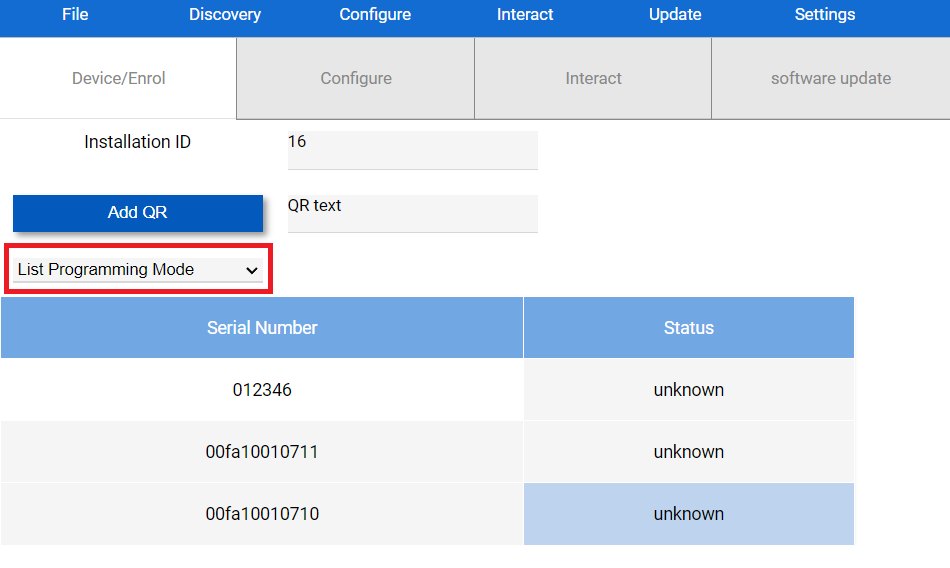
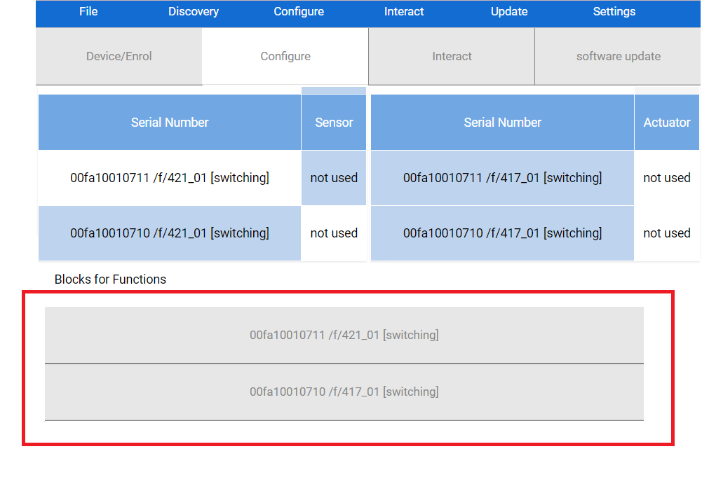
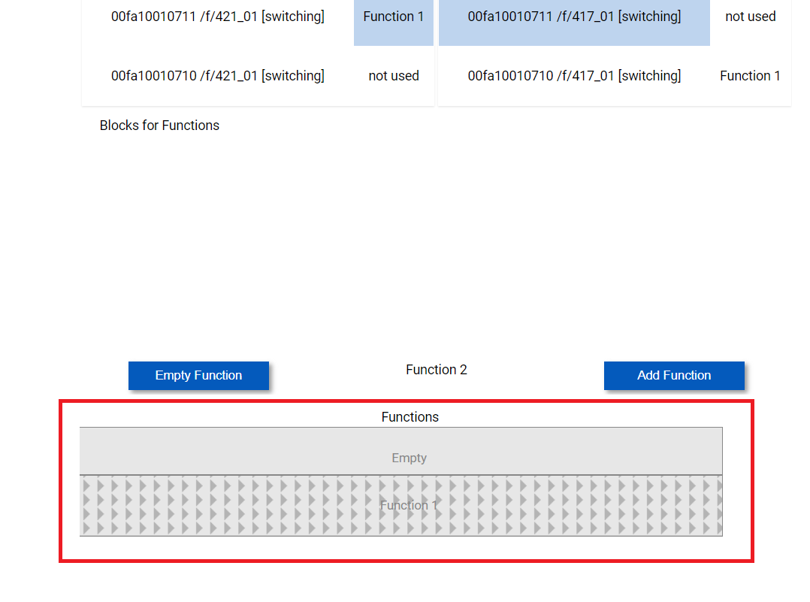

# KNX IoT Example Application - Getting Started with the Linker

This guide will help you configure your two development boards once they are on-boarded onto the same Thread network. By the end, you will be able to use a button on one devboard to control a light on the other.

## Step 0: Configuring using the Linker

### Discover your devices
1. Launch the Linker. Check your hub firmware version by navigating to `Status -> Overview`. If your firmware version is `KNX-IoT-Hub-OpenWrt 1.5` or later, the Linker will be available at http://192.168.1.1:8081 . Otherwise, [download the latest KNX IoT Hub image](https://github.com/Cascoda/OpenWrt/releases) and update the firmware on the hub using `System -> Backup/Flash Firmware`, by following [the guide on the OpenWRT wiki](https://openwrt.org/docs/guide-quick-start/sysupgrade.luci#verify_firmware_file_and_flash_the_firmware).
    - Before flashing the image, ensure that the "Keep settings and retain the current configuration" checkbox is ticked. Otherwise, the hub will no longer have access to the Thread network created in Step 2. 
2. Discover the devboards by clicking on `Discovery` from the menu bar, and selecting `Discover Devices (CoAP)` from the dropdown.
3. After a few seconds, you will see two new devices get listed on the main window. One with a Serial Number 00fa10010710, and the other with Serial Number 00fa10010711. _DISAMBIGUATION: The term "Serial Number" as it appears in the Linker refers to the KNX Serial Number, which has nothing to do with the devboard serial number mentioned previously!_

### Enrol your devices

1. Click on the dropdown item which displays the text `List Programming Mode` by default. 

2. Select `Enrol device` from the options shown in the dropdown.
3. Click on one of the two devices which have the aforementioned serial numbers. You will get prompted to enter a QR or password for that device.
4. Referring back to the KNX QR code messages that you had copy-pasted earlier during joining: You will notice that it consists of two parts. The first part: `KNX:S:00fa10010710` contains the KNX serial number. The second part `P:4N6AFK6T83YWDUTW23U2` contains the password. Out of the two messages you had saved, locate the one which contains the serial number of the device that you are about to enrol.
5. Copy the password (e.g. in this case 4N6AFK6T83YWDUTW23U2), and paste it into the input field, replacing `QR`.
6. Click `Ok`.
7. After a few seconds, you will see the word `Ok` in the `Status` column.
8. Repeat from step 3 but with the other device.
9. Both devices are now enrolled and are ready to be configured.

### Configure your devices

1. Under the menu bar, there is a selection of different tabs/pages that you can go to for different functions. Click on the `Configure` tab.
2. From the menu bar, click on `Configure` and click on `Populate Functional Blocks`. A few seconds later, the tables in the main view will get populated with a total of 4 entries, 2 for each of the devboards. These are called functional blocks.
3. Note that there are two tables: The sensor table, containing the `Sensor` column and the actuator table, containing the `Actuator` column. Each table contains a single entry for each devboard, distinguished by serial number (so 2 entries in the sensor table and 2 in the actuator table). The goal is to connect one devboard's "sensor" functionality to the other devboard's "actuator" functionality, so that the "sensor" may control the "actuator". From the sensor table, select one of the devboards by clicking on one of the entries under the `Serial Number` column. The selection will be displayed under the two tables.
4. Take note of the serial number of the selected device, and select the other device (the one with the different serial number) from the actuator table. You should see both selections now appear under the tables as such: 

5. Terminology: Each selection is called a "Functional block", and the combination of mulitple associated blocks together is called a "Function". Click on the `Add Function` button to add this function! It will now appear under the `Functions` section, as such: 

6. Now repeat steps 3 to 5 for the two remaining functional blocks, so that the devboard that was selected as "actuator" now gets selected as sensor, and vice versa. The result is that you now have two "Functions", one connecting `00fa10010710`'s sensor to `00fa10010711`'s actuator, and another one connecting `00fa10010711`'s sensor to `00fa10010710`'s actuator.
7. From the menu bar, click on `Configure`, click on `Create Configurations & Download All Devices`. This operation will take a few seconds to complete. Hover your mouse over the area where the sensor and actuator tables are located. If there is a loading wheel spinning then the operation is in progress. When it stops spinning, the operation is complete.

## Step 1: Play with your devices

If you have followed all the previous steps successfully, you will now have two configured KNX devices, which can mutually communicate with each other via the hub.

Press the button that says SW1 on either of the devboards. This should cause the LED that is next to SW2 on the other devboard to toggle!

## Step 2: Going further

This KNX application may receive updates from time to time. To grab the latest version, [click here](https://github.com/Cascoda/knx_iot_example).

This application just serves as an example to get you familiar with the process of setting up a KNX configuration. We offer a variety of much more sophisticated applications. A [full list of KNX IoT applications is available here](https://github.com/Cascoda/cascoda-sdk/blob/master/docs/how-to/howto-knxiot.md). Note that most of those will require additional hardware, such as e-Paper displays, sensors, etc.

If you would like to get to know the Cascoda SDK better, you may [take a look at the main Readme document](https://github.com/Cascoda/cascoda-sdk/blob/master/README.md)

We also provide [a packet sniffer that is designed to work alongside KNX-IoT](https://www.cascoda.com/products/packet-sniffer/). The sniffer is able to decrypt the OSCORE communications used by KNX-IoT and is therefore an invaluable development tool.

Finally, the [Cascoda SDK Reference document](https://github.com/Cascoda/cascoda-sdk/blob/master/docs/reference/full-reference.md) contains a comprehensive overview of all of our documentation, which includes tutorials, detailed information on using Thread, flashing and debugging using device programmers, system architecture & API reference.

Feel free to [contact us for more information!](mailto:support@cascoda.com)
