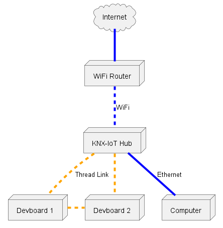

# KNX IoT Example Application - Alternative Network Topologies

This guide contains several alternative network topologies that we support for the KNX-IoT Development Kit & Getting Started guide.

## Wireless link to Computer

If you cannot connect your computer to the Hub via Ethernet, you can use the Hub's WiFi Access Point instead. After powering on the Hub, press the grey WiFi button at the top of the device and wait for it to start blinking. Doing so creates an open WiFi hotspot called "OpenWRT". Connecting to this hotspot gives you access to the Hub's OpenWRT Web GUI just like the LAN1 connection would.

## Wireless link to the Internet

If you do not have wired Internet access, you may set up the KNX IoT Hub to join a pre-existing WiFi hotspot. Please connect your computer to the hub's LAN1 ethernet port, and [follow OpenWRT's guide on connecting to a Client WiFi network](https://openwrt.org/docs/guide-user/network/wifi/connect_client_wifi).
