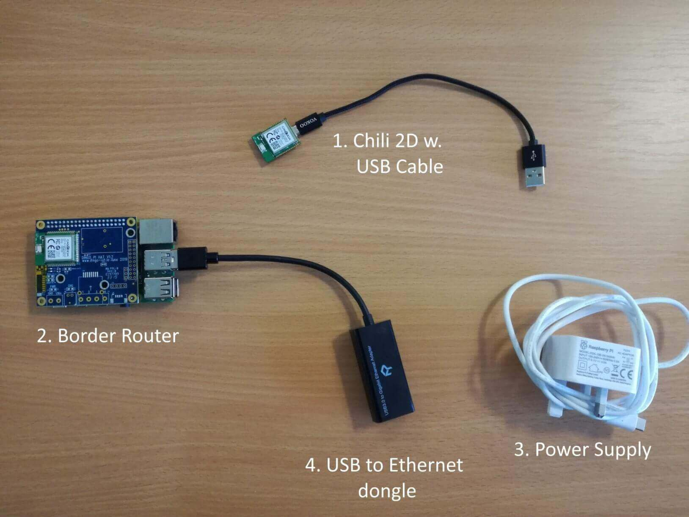
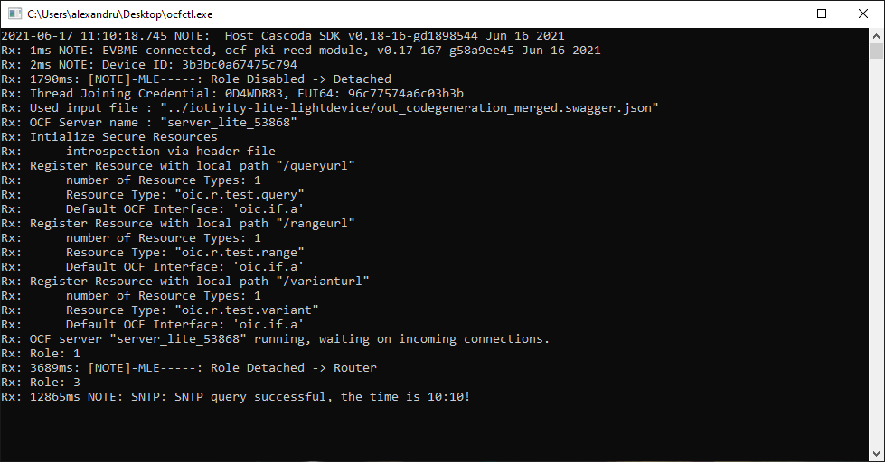
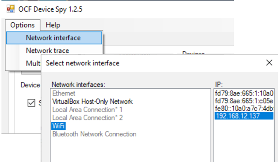
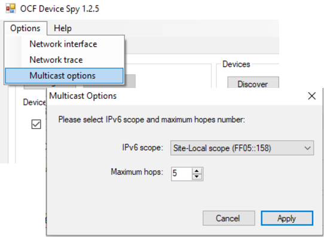

# Getting Started with OCF and Thread
The purpose of this document is to provide the reader with all the required knowledge and steps to create and run new or pre-existing OCF applications over Thread, using our Cascoda SDK and the Chili2 modules.

## Contents

<!-- TOC -->

- [Getting Started with OCF and Thread](#getting-started-with-ocf-and-thread)
  - [Contents](#contents)
  - [Important references](#important-references)
  - [Step 0 - Building the Cascoda SDK (optional)](#step-0---building-the-cascoda-sdk-optional)
  - [Step 1 - Prerequisite Knowledge](#step-1---prerequisite-knowledge)
  - [Step 2 - Getting Started](#step-2---getting-started)
  - [Step 3 - Creating OCF Applications over Thread](#step-3---creating-ocf-applications-over-thread)
  - [Step 4 - Thread Network Set-Up and Configuration](#step-4---thread-network-set-up-and-configuration)
  - [Step 5 - OCF Device Spy Configuration](#step-5---ocf-device-spy-configuration)
  - [Step 6 - Interact with your OCF server using OCF Device Spy](#step-6---interact-with-your-ocf-server-using-ocf-device-spy)

<!-- /TOC -->

## Important references
All OCF specification documents can be found [here](https://openconnectivity.org/developer/specifications/). The most useful ones for the purposes of this guide are the following documents: Core Framework, Core Optional Framework, Resource Type, and Device.

## Step 0 - Building the Cascoda SDK (optional)
If you would like to create your own OCF over Thread applications, you will need to build the Cascoda SDK. Please follow the instructions in the "Building" section [here](../../README.md) that explains how to do that.
On the other hand, if you only intend to run pre-existing OCF applications, then you can skip this step, because all the necessary binaries can be downloaded from [here](https://github.com/Cascoda/cascoda-sdk/releases/latest).

## Step 1 - Prerequisite Knowledge
- Read the contents of the "About Us" page of OCF's official website [here](https://openconnectivity.org/foundation/), to get a quick understanding of the context and reason behind the implementation of this technology. Note that OCF is a set of specifications. To do anything useful with it, it needs to be implemented; IoTivity is such an implementation.
- Read the contents of the "IoTivity Architecture" page of IoTivity's official website [here](https://iotivity.org/architecture/). This should introduce what IoTivity is, and should also explain that OCF can run over Wi-Fi, Ethernet, and Thread. 
- Visit the "Technology" page of OCF's official website [here](https://openconnectivity.org/technology/), which explains how to establish Device-to-Device, Device-to-Cloud, and Cloud-to-Cloud communication. You only need to read the contents of the "Device-to-Device" section for the purposes of this guide. The key concepts to understand are:
    - An OCF device is a device which implements the OCF Core Specification. To learn more about OCF devices and for a list of pre-existing ones, see the OCF specification document titled "Device".
    - The function of an OCF device (i.e. what it does/can do) is determined by what is known as its resources. To learn more about resources and for a complete list of them, see the OCF specification document titled "Resource Type". **NB**: OCF used to be called OIC (Open Interconnect Consortium), and that is why the device and resource types all start with "oic.".
    
## Step 2 - Getting Started
- Follow along IoTivity's device simulation guide [here](https://iotivity.org/GS_DS/), which will get you familiar with the concepts of an OCF Server device, an OCF Client device, and with the general workflow of generating, building and running OCF server code.
- Note: If you don't have a linux machine, you can use a raspberry pi running Raspberry Pi OS instead.
- Note: We have used the Windows onboarding tool called [OCF Device Spy](https://iotivity.org/tools/#ocf-device-spy) instead of the linux OTGC that is suggested in the guide. Follow the instructions [here](https://openconnectivityfoundation.github.io/development-support/DeviceSpy/) to download the tool.
    - For this guide to work with OCF Device Spy instead of the linux OTGC, make sure that the Windows machine and the linux (or Raspberry Pi OS) machine running the server are part of the same Ethernet network.
    - Once installed, if OCF Device Spy produces an error when you try to run it, then execute the installer again, and select "Remove OCF Device Spy". Then execute the installer once more to reinstall OCF Device Spy. It should work now.
    - For a full guide on how to use OCF Device Spy, open the tool, click on "Help" and select "User Guide". This will only properly work if opened with Internet Explorer.
- Note: In case OCF Device Spy cannot discover the OCF server anymore, try stopping it (Ctrl + C), running the `./reset.sh` script, and then running the server again. This deletes all the device builder credentials on the server side, which should fix this problem.

## Step 3 - Creating OCF Applications over Thread
- Read through [this guide](../guides/create-custom-ocf-applications.md) in the Cascoda SDK, which explains how to create custom OCF applications, import them into the Cascoda SDK, and make the necessary changes to interface with hardware, such as sensors.
- Have a look at this README file [here](../../ocf/README.md) for a list of all the existing OCF applications currently available in the Cascoda SDK, which have been generated in the exact same way as was described in the previous bullet point.

## Step 4 - Thread Network Set-Up and Configuration
The OCF applications mentioned in [Step 3](#step-3---creating-ocf-applications-over-thread) run over Thread, which is a low-power wireless protocol based on IPv6. For that reason, some setting up and configuration will be necessary in order to get the Thread network running and get the Chili module to join that network. The following points will guide you through this process.

- First, gather the necessary hardware, as pictured below (ignore the USB to Ethernet dongle, it isn't needed for the purposes of this guide):
    - A Cascoda Chili 2D module - This is where the OCF application/server will run.
    - A micro USB to USB cable - This makes it possible to connect the module to a PC.
    - A Cascoda Border Router - This will form a Thread network, and provide a way for OCF Device Spy to communicate to the OCF server. [Here](../guides/border-router-setup.md) is a guide on how to set up a Border Router and form a Thread network.
    

- Flash the Chili 2D module (guide [here](../guides/flashing.md)) with the OCF application that you want to run.
- Power the module, which you can do by simply connecting it to your Windows PC using the USB cable.
- Commission the Chili 2D module onto the Thread network formed by the border router. A guide on how to do this is found [here](../guides/thread-commissioning.md).
- Check that the module has successfully joined the Thread network by running [ocfctl](../../posix/app/ocfctl/README.md) while the module is connected to the PC with the USB cable. To download `ocfctl` for Windows, go to the [latest release](https://github.com/Cascoda/cascoda-sdk/releases/latest) of the Cascoda SDK, and download the `Windows-SDK.zip` file, which contains `ocfctl`.
- After running `ocfctl`, you should get something that looks similar to the picture below:

- The important parts of that message are:
    - "Role Detached --> Router" - This means that the device has successfully connected to the Thread network owned by the border router. Sometimes it transitions to the Child role, which is also good.
    - "SNTP query successful, the time is XX:XX!" - This indicates that the Chili has joined the Thread network and is able to contact the Internet. If you see this message, it is almost certain all communications on the Chili are working fine.

- **Troubleshooting:** If you get any of the following after running `ocfctl`:
    - SNTP failure
    - Role is Leader instead of Router or Child
    - Role is still Detached
    - Something else that doesn't match up with the expected successful output
- ... then type the "factory" command into ocfctl, in order to delete the existing Thread credentials. Then, try commissioning the device onto the Thread network again.
- Once you've verified that the Chili module has successfully joined the Thread network, you can move on to the next step.

## Step 5 - OCF Device Spy Configuration
A few more configurations need to be made on OCF Device Spy before it can discover your OCF server. This is because unlike in [Step 2](#step-2---getting-started) where OCF Device Spy was communicating with the OCF server over Ethernet, here it is communicating with the server indirectly via the border router. The messages that OCF Device Spy sends out are received by the border router over Wi-Fi, and then are routed to the OCF server over Thread. To achieve that, do the following.

- Connect your Windows PC running OCF Device Spy to the Border Router's Wi-Fi. This should give you access to the Internet.
- Open OCF Device Spy, and select Wi-Fi as the network interface, as shown in the picture below.

- Since the Thread network is a separate network, the OCF multicast discovery to find devices will only work on site-local scope. To configure site local scope on OCF Device Spy, do the following: Options > Multicast Options > Select "Site-Local scope" from the IPv6 scope dropdown.
- Make sure to also increase the number of maximum hops to 5.

## Step 6 - Interact with your OCF server using OCF Device Spy
- Now, OCF Device Spy should be ready to discover, onboard, and interact with the OCF server running on the Chili 2D module, in the exact same way as you would have done in [Step 2](#step-2---getting-started).

