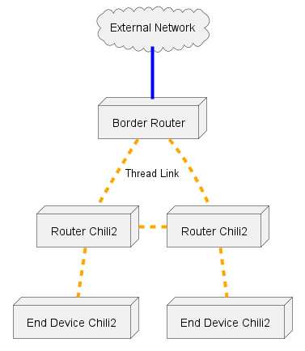

# Getting Started with Thread

This document aims to introduce the Thread Protocol, and how to form and use a Thread Network using Cascoda hardware.

This document assumes the use of the [Cascoda Thread Evaluation Kit.](https://innovelec.co.uk/brand/cascoda/)


## Contents

<!-- TOC -->

- [Contents](#contents)
- [The System Overview](#the-system-overview)
- [Step 1 - Get the Binaries](#step-1---get-the-binaries)
- [Step 2 - Configure the Border Router](#step-2---configure-the-border-router)
- [Step 3 - Form the Network](#step-3---form-the-network)
- [Step 4 - Join the other devices to the network](#step-4---join-the-other-devices-to-the-network)
- [Step 5 - Demonstrate Communication](#step-5---demonstrate-communication)
- [Next Steps](#next-steps)

<!-- /TOC -->

## The System Overview

The [Cascoda Thread Evaluation Kit](https://innovelec.co.uk/brand/cascoda/) contains most of the required parts for evaluating Thread functionality. In addition, a Raspberry Pi is required.

The Chili2D USB dongles are used as Thread devices, which in a real network could be sensors or actuators. 
The Thread stack is running on the Chili2 in the [ot-cli](../../baremetal/cascoda-bm-thread/example) firmware, and can be controlled using the 'OpenThread CLI' which is available over USB.
This is the [On-Module](../reference/system-architecture.md#on-module) system model.
This firmware has been configured to use USB as a serial interface.
To access the OpenThread CLI, [serial-adapter](../../posix/app/serial-adapter) should be run on a host operating system which the Chili2D is connected to via USB.

The Chili2S Pi Hat is used as an IEEE 802.15.4 interface, running [mac-dongle](../../baremetal/app/mac-dongle) as firmware. The Thread
stack is running on the Raspberry Pi itself, taking advantage of the additional resources. 
This is the [Radio Co-Processor](../reference/system-architecture.md#radio-co-processor) system model.
This firmware has been configured to use UART as a serial interface.

The Raspberry Pi acts as a Thread Border Router, and is capable of routing IPv6 traffic between the Thread Network and the adjacent
Ethernet network and hosted WiFi access point. It also hosts a Web UI to allow control of the Thread Network.

<p align="center"></p>

*Example Mesh network for the 4-Chili evaluation kit, with 2 router enabled nodes, and 2 end device nodes. Note
that the end device nodes may connect to any Router device.*

## Step 1 - Get the binaries

The binaries should be pre-flashed on the devices when the kit is received, but in case it is an old version, or if the firmware has
been overwritten, it can be reflashed.

Pre-built binaries can be obtained from the [GitHub releases page](https://github.com/Cascoda/cascoda-sdk/releases), or binaries can be
built from scratch by following the [build instructions.](../../README.md#building) It is important that the Pi Hat is flashed with firmware configured with the [interface configured as UART](../reference/cmake-configuration.md#cascoda_bm_interface), and the USB modules are flashed with firmware configured to have a [USB interface](../reference/cmake-configuration.md#cascoda_bm_interface).

The Chili2D USB devices should be flashed with [ot-cli](../../baremetal/cascoda-bm-thread/example), the Pi Hat should be flashed with [mac-dongle](../../baremetal/app/mac-dongle).

To flash the firmware over USB (or other), consult the [flashing guide.](../../docs/guides/flashing.md)

## Step 2 - Configure the Border Router

A pre-configured SD Card should be provided with your kit. It is necessary to log in with the default username 'raspberry'
and default password 'pi' at least once to complete configuration. It may also be necessary to expand the filesystem using the
``raspi-config`` utility.

To create a new SD card, it is possible to download the image from the [install-script releases page](https://github.com/Cascoda/install-script/releases), which can be flashed with a tool such as [win32 disk imager](https://sourceforge.net/projects/win32diskimager/).

Alternatively it is possible to follow the initial setup section from the [border router setup guide.](../guides/border-router-setup.md), although this script can take quite a long time to run.

## Step 3 - Form the Network

Form a network by following the [network formation guide.](../guides/thread-network-formation.md)

## Step 4 - Join the other devices to the network

After forming a network, add the Chili2D devices by following [the commissioning process.](../guides/thread-commissioning.md)

## Step 5 - Demonstrate communication

To demonstrate communication between the devices, the simplest mechanism is to try to send a ping between the devices.

Using ``serial-adapter`` to control one of the ``ot-cli`` devices, get the 'mesh local' IPv6 address using the ``ipaddr`` command.

```bash
> ipaddr
fd3d:b50b:f96d:722d:0:ff:fe00:fc00
fd3d:b50b:f96d:722d:0:ff:fe00:c00
fd3d:b50b:f96d:722d:7a73:bff6:9093:9117
fe80:0:0:0:6c41:9001:f3d6:4148
Done
```
In this case, the first is the 'leader anycast' address, and be identified by it's  ``:0:ff:fe00:fc00`` suffix. It will always be owned
by the current leader of the Thread Network partition. 
The ``fd3d:b50b:f96d:722d:0:ff:fe00:c00``  address is the 'RLOC' address, and can change if the network topology changes.
The ``fd3d:b50b:f96d:722d:7a73:bff6:9093:9117`` address is the 'Mesh Local' address, and will not change, but cannot be routed off-mesh.
Note that those first 3 addresses all have the same prefix, which is based off the Extended PAN ID of the network.
The ``fe80::`` prefixed address is link local, so that is usually not useful as it only works over one hop.

If the border router has been configured correctly, there will also be a global IPv6 address in that list, that can be routed off mesh. 

So from the other device, ping the mesh-local address:

```bash
> ping fd3d:b50b:f96d:722d:7a73:bff6:9093:9117
16 bytes from fd3d:b50b:f96d:722d:7a73:bff6:9093:9117: icmp_seq=1 hlim=64 time=24ms
```

You should also be able to ping from the raspberry pi.

In order to determine the topology of the network, the ``neighbor table`` command can be used on the CLI. To allow a device
to become a router (or force it to become a child), the ``routerrole enable`` and ``routerrole disable`` commands can be used.
For more information on commands, see the [OpenThread CLI Reference.](https://github.com/Cascoda/openthread/blob/ext-mac-dev/src/cli/README.md)

## Next steps

For a more interesting demo, look into [sensordemo](../../baremetal/cascoda-bm-thread/example), which is included in the flashed
binaries already. Alternatively, look into [OCF](howto-ocf-thread.md), for a more advanced demo, with a real world, secure application
layer.
