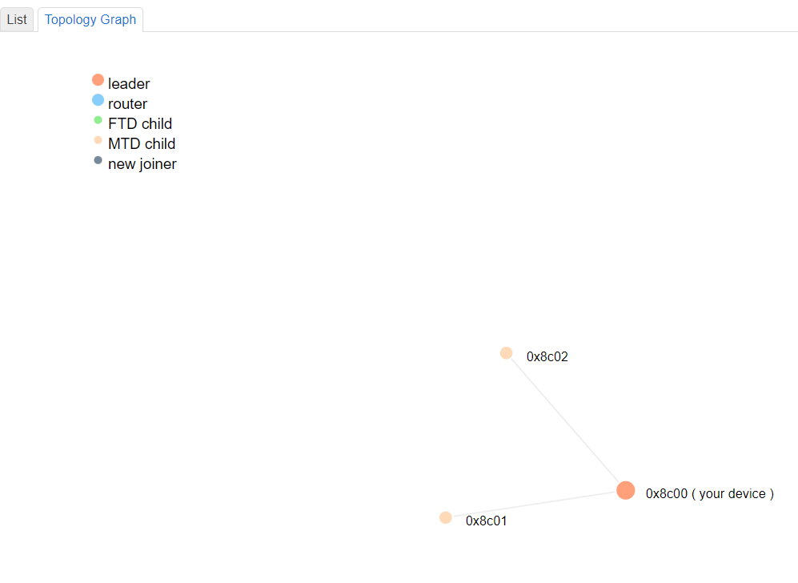

# KNX IoT Example Application - Getting Started Guide

This guide will get you up and running with your first KNX IoT application! Little to no prior knowledge is needed, all that is required is to have the correct hardware, and to follow the steps of the guide exactly as described.

This guide showcases KNX IoT over Thread by enabling the two devboards to talk to each other. At the end of the guide, and following configuration with ETS or the Linker, you will be able to toggle an LED on one devboard with a button press on the other.

Here is the network topology that will be created as a result of the guide:


The KNX IoT Hub™ firmware is based on OpenWRT. Its purpose is to provide a link between your computer and the Thread mesh network. At the same time, if connected to the Internet it forwards said internet connection to your computer, just like a residential WiFi router would.

## Step 0: Requirements

Please ensure you have the following hardware and software requirements before proceeding any further.

### Hardware

- [The Cascoda KNX IoT Development Kit](https://www.cascoda.com/products/knx-iot-development-kit/), consisting of the KNX IoT hub, two devboards & necessary accessories
- A Windows PC
- Access to the Internet through an Ethernet port & one extra Ethernet cable
    - It is possible to access the internet wirelessly, or complete the guide without access to the internet. If this is a requirement please take a look at the [alternative topologies guide](howto-knxiot-topologies.md).
    - If you do not have access to the Internet through the Hub, you will need to download the Hub & Devboard binaries beforehand. Additionally, the Thread Network Topology graph will not render.

### Software (on your Windows PC)

- An installation of Cascoda's Windows Tools. Please [download CascodaWindowsTools.zip and run the installer within](https://github.com/Cascoda/cascoda-sdk/releases/latest). Two of the tools will be necessary for this guide, namely `chilictl.exe` and `serial-adapter.exe`.

## Step 1: Set up

1. Attach the antenna to the hub by screwing it in, then angle it upwards for maximum coverage.
2. Connect the hub to your Windows PC via Ethernet (the cable goes into the PoE LAN1 port).

<p align="center"></p>

3. Connect the hub to your internet router or switch via Ethernet, by connecting one end of the cable into the WAN/LAN2 port of the hub, and the other end of the cable into your internet router/switch.
4. Now power up the hub using the power adapter.
5. Connect the two devboards to your Windows PC via USB.

## Step 2: Update your firmware

NOTE: This part of the guide will make use of the Cascoda Windows Tools that you have installed as part of the software requirements. By default, these tools are added to your `PATH`, enabling their execution in a shell in any directory. However, if this did not occur, you will only be able to execute the tools from within the directory in which they are installed. The default installation directory is `C:\Program Files (x86)\Cascoda Windows Tools`.

### Updating the KNX IoT Hub

[Download the latest KNX IoT Hub™ image](https://github.com/Cascoda/OpenWrt/releases) and update the firmware on the hub using `System -> Backup/Flash Firmware`, by following [the guide on the OpenWRT wiki](https://openwrt.org/docs/guide-quick-start/sysupgrade.luci#verify_firmware_file_and_flash_the_firmware).

### Updating the two devboards

To ensure that the devboards are running the latest firmware, you will have to download the latest firmware and flash it onto both devices.

1. Please [download the latest embedded binaries from our GitHub repository](https://github.com/Cascoda/knx_iot_example/releases/). For this guide, you will need the `embedded_secured.zip` archive.
2. Extract the archive and open a terminal inside the folder containing the binaries - `embedded_secured/build_win_bin/bin`. 
3. Inside this terminal, enter the `chilictl list` command.
4. Information about both connected devboards should now be displayed on the screen in this fashion:
    ```
    PS C:\Users\Administrator> chilictl.exe list
    2023-05-25 12:40:32.502 NOTE:  Host Cascoda SDK v0.23-6-gefd3f47 May 22 2023
    Device Found:
            Device: Chili2
            App: knx_iot_example_240523_e730064
            Version: v0.23-6-gefd3f47
            Serial No: 82830D8702A7566B
            Path: \\?\hid#vid_0416&pid_5020#a&13e664b5&0&0000#{4d1e55b2-f16f-11cf-88cb-001111000030}
            Available: Yes
            External Flash Chip Available: Yes
    Device Found:
            Device: Chili2
            App: knx_iot_example_240523_e730064
            Version: v0.23-6-gefd3f47
            Serial No: 60F373F8446594E6
            Path: \\?\hid#vid_0416&pid_5020#a&235ac66c&0&0000#{4d1e55b2-f16f-11cf-88cb-001111000030}
            Available: Yes
            External Flash Chip Available: Yes
    ```
    Please note down the serial numbers of the two devices, in this case 82830D8702A7566B and 60F373F8446594E6.
5. Flash the devices one by one using the `chilictl flash -f knx_iot_example_reed.bin -s <SERIAL_NUMBER>`, using the serial numbers obtained from `chilictl list`. For example, here is what the result of flashing the device with serial number 82830D8702A7566B would look like:

    ```
    PS C:\Users\Administrator\Downloads\embedded_secured\build_win_bin\bin> chilictl flash -f .\knx_iot_example_reed.bin -s  82830D8702A7566B
    Last write time of .\knx_iot_example_reed.bin is: 07/04/2023  15:07
    2023-07-05 11:49:26.584 NOTE:  Host Cascoda SDK v0.24-44-g38f1b1a3 Jun 20 2023
    1 devices found.
    Flasher [82830D8702A7566B]: INIT -> REBOOT
    Flasher [82830D8702A7566B]: REBOOT -> ERASE
    Flasher [82830D8702A7566B]: ERASE -> FLASH
    Flasher [82830D8702A7566B]: FLASH -> VERIFY
    Flasher [82830D8702A7566B]: VERIFY -> VALIDATE
    Flasher [82830D8702A7566B]: VALIDATE -> COMPLETE
    ```

## Step 3: Create a Thread network

### Form a Thread network on the hub

1. Access the hub's Web GUI hosted on http://openwrt.local. Note: It takes 1 minute for the hub to start up after power-up. So the Web GUI won't be accessible until then.
2. If a login prompt comes up, just click OK, because the hub does not have a password by default.
3. Double check that you have internet access via the hub by opening up any web browser and searching something.
4. Now back to the hub's web GUI, you will see a menu bar at the top, hover over `Network`, and click on `Thread`.
5. Click on `Create`.
6. Scroll down to the bottom and click on `Save & Apply`. (If you have some Thread knowledge, feel free to change any of the fields to your liking before saving.)
7. Your Thread network should now be visible under `Network -> Thread`!

### Join the devboards to the Thread network

1. Open an instance of Windows PowerShell.
2. Type `chilictl.exe list`. If an error occurs, try prepending the path, e.g.
    ```powershell
    & 'C:\Program Files (x86)\Cascoda Windows Tools\chilictl.exe' list 
    ```
    If that still doesn't work, then it is likely that the Cascoda Windows Tools haven't been installed.
3. Information about both connected devboards should now be displayed on the screen in this fashion:
    ```
    PS C:\Users\Administrator> chilictl.exe list
    2023-05-25 12:40:32.502 NOTE:  Host Cascoda SDK v0.23-6-gefd3f47 May 22 2023
    Device Found:
            Device: Chili2
            App: knx_iot_example_240523_e730064
            Version: v0.23-6-gefd3f47
            Serial No: 82830D8702A7566B
            Path: \\?\hid#vid_0416&pid_5020#a&13e664b5&0&0000#{4d1e55b2-f16f-11cf-88cb-001111000030}
            Available: Yes
            External Flash Chip Available: Yes
    Device Found:
            Device: Chili2
            App: knx_iot_example_240523_e730064
            Version: v0.23-6-gefd3f47
            Serial No: 60F373F8446594E6
            Path: \\?\hid#vid_0416&pid_5020#a&235ac66c&0&0000#{4d1e55b2-f16f-11cf-88cb-001111000030}
            Available: Yes
            External Flash Chip Available: Yes
    ```
4. By default, your devboards will come pre-programmed with an application called `knx_iot_example_ddmmyy_xxxxxxx`. Each devboard also has a unique serial number. Copy and paste both serial numbers somewhere, as you will need them later. In our example here, the serial numbers are: 82830D8702A7566B and 60F373F8446594E6.
5. Now type `serial-adapter.exe` followed by one of the serial numbers, i.e. 
    ```
    PS C:\Users\Administrator> serial-adapter.exe 82830D8702A7566B
    ```
    This will open up a serial communication channel with that devboard. 
6. You should start seeing messages coming from the devboard via serial-adapter, getting displayed periodically. They will look something like this:
    ```
    PS C:\Users\Administrator> serial-adapter.exe 82830D8702A7566B
    2023-05-25 15:18:50.757 NOTE:  Host Cascoda SDK v0.23-6-gefd3f47 May 22 2023
    Rx: Trying to join Thread network...
    Rx: Thread Joining Credential: YR5XH9X3, EUI64: 6a56a702870d8382
    ```
    Keep this serial-adapter open for the time being.
7. Navigate to `Network -> Thread` in the hub web GUI.
8. Click on `View` on the side of the network formed by your hub.
9. Click on `Add` in the bottom right corner of the page. You will now see two input fields, one that says `New Joiner Credential` and one that says `Restrict to a Specific Joiner`.
10. From the serial-adapter output, copy the `Thread Joining Credential` (in this case YR5XH9X3) and paste it into the `New Joiner Credential` field, replacing the default text there. Likewise, copy the `EUI64` (in this case 6a56a702870d8382) from the serial-adapter output and paste it into the `Restrict to a Specific Joiner` field.
11. Click on `Add`.
12. Monitor the running serial-adapter output, until the KNX QR code (such as the one shown below) is printed. This means that the device has successfully joined the network.
13. Make a record of the enrollment data, displayed in the KNX QR code string format - you will need it for enrolling the devices using either the Linker or ETS6. The message you need will look something like this:
    ```
    Rx:  === QR Code: KNX:S:00FA10010710;P:4N6AFK6T83YWDUTW23U2 ===
    ```
14. You may now terminate serial-adapter (this won't affect the devboard, it will only close the communication channel) by pressing Ctrl + C in PowerShell.
15. Repeat the exact same thing from step 5, but this time providing the serial number of the other devboard, in this case 60F373F8446594E6.
16. You should now have both devboards joined to the network formed by the hub.
    - Note that once the devboards have joined the Thread network, they will remain attached on the Thread network until a factory reset is performed by pressing and holding the programming mode button for more than 10 seconds.
17. Finally, verify that the devices are truly on the network, by looking at the network topology in the hub: Navigate to `Network -> Thread`, click on `View`, then `Topology Graph`. You should see something that looks like this (NOTE: this will only work if you've successfully connected to the internet via the hub): 

<p align="center"></p>

- Please note that the network might look slightly different if you are using REED devices, as they are capable of upgrading to routers after they have joined. It is also not mandatory for the Hub to be the leader.

## Step 4: Configuring KNX devices

As stated in the intro, this can be done via [ETS](howto-knxiot-devkit_knx_tools.md) or via's [Cascoda's Linker](howto-knxiot-devkit_linker.md).

## Troubleshooting

### Cannot flash devboard / Cannot access devboard logs using serial-adapter
A devboard can only be controlled by one Cascoda tool at any given time. This means that you will not be able to flash a device if you have serial-adapter communicating to the same device - you must close serial-adapter first. Likewise, only one serial-adapter instance can be used per device, and serial-adapter cannot be opened on a device while it is being flashed.

To see if a particular device is available, use `chilictl list` and look at the "Version" field. Available devices will have a version number such as "v0.23-6-gefd3f47", whereas unavailable devices will show "???" under the Version field.