# Battery Monitoring

## Devboard Jumper Configurations

To use the battery monitoring functions, jumpers U14/17, U23, and U27 should be populated. Each pin on jumper U14/17 correspond to different functionality respectively and can be used individually, not all of them have to be populated at the same time. The description of each pin on jumper U14/17 are as follows:

| Pin Name | Signal | Description |
| --- | --- | --- |
| INT | USB_PRESENT | USB (or external) +5V is connected |
| RST | VOLTS_TEST | Battery Voltage Measurement: Control |
| PWM | VOLTS | Battery Voltage Measurement: Battery Voltage to ADC for Measurement |
| AN | CHARGE_STAT | Battery Charging Status (Charging/Not Charging) |

**NOTE**: VOLTS_TEST and VOLTS both need to be populated at the same time if the battery voltage is to be measured.

## Methodology for Battery Percentage Calculation

If VOLTS_TEST and VOLTS are enabled, the battery voltage could be measured and converted to its corresponding value in percentage (%) by using the battery's charge/discharge curve. Note that every type of battery will have its own charge/discharge curve. The battery types currently implemented are the RCR123A 3.7V Rechargeable Lithium-Ion Battery and the CR123A 3V Non-Rechargeable Lithium Battery.

### RCR123A 3.7V Rechargeable Lithium-Ion Battery

The typical 3.7V Lithium-Ion Battery [voltage vs capacity table](https://blog.ampow.com/lipo-voltage-chart/) is shown as follows:

| Capacity | Voltage |
| --- | --- |
| 100 | 4.20 |
| 95 | 4.15 |
| 90 | 4.11 |
| 85 | 4.08 |
| 80 | 4.02 |
| 75 | 3.98 |
| 70 | 3.95 |
| 65 | 3.91 |
| 60 | 3.87 |
| 55 | 3.85 |
| 50 | 3.84 |
| 45 | 3.82 |
| 40 | 3.80 |
| 35 | 3.79 |
| 30 | 3.77 |
| 25 | 3.75 |
| 20 | 3.73 |
| 15 | 3.71 |
| 10 | 3.69 |
| 5 | 3.61 |
| 0 | 3.27 |

The voltage vs capacity graph is then plotted using Excel and is shown as follows:

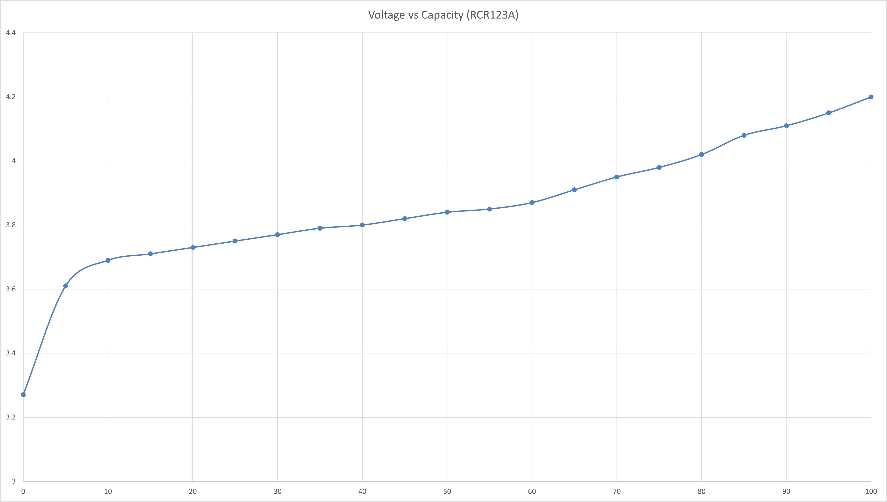

The curve is then split into a few regions where each region could be reasonably linearised with a line of best fit. The straight line equation of each linearised region is obtained and the battery percentage value could be calculated correspondingly.

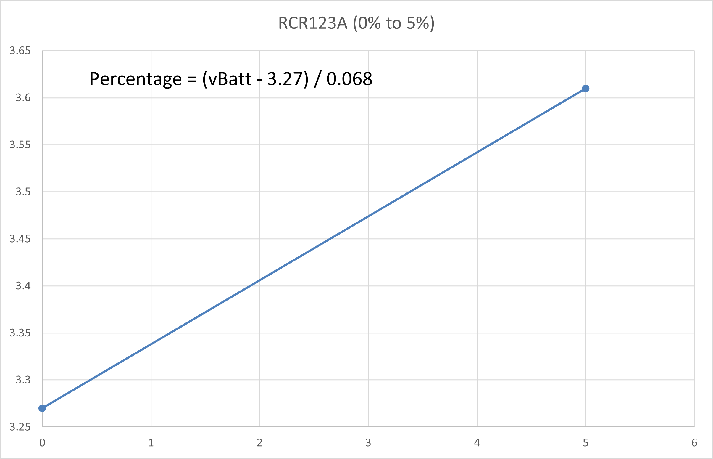

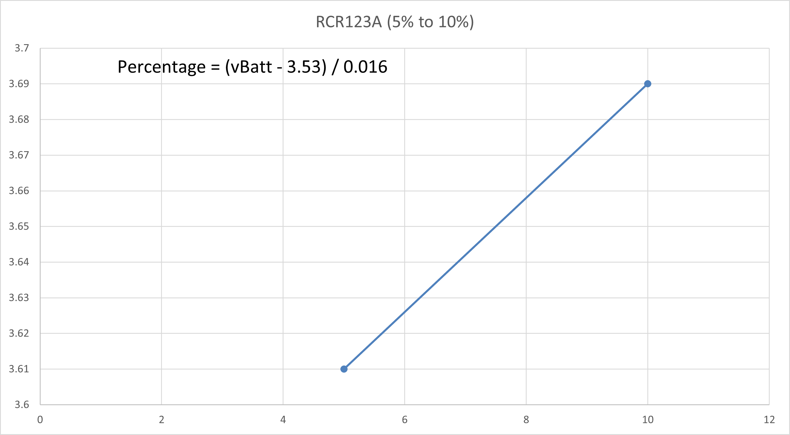

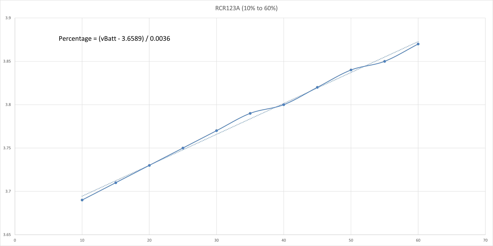

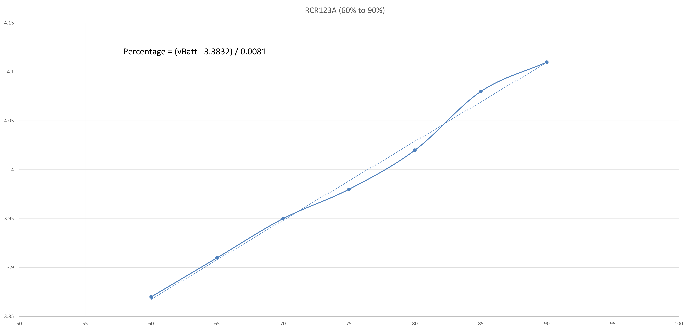

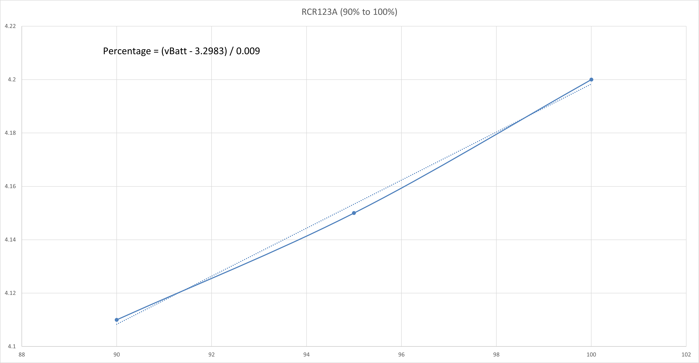

### CR123A 3V Non-Rechargeable Lithium Battery

The typical 3V Lithium Battery voltage vs capacity table is shown as follows:

| Capacity | Voltage |
| --- | --- |
| 100 | 3.15 |
| 95 | 2.91 |
| 90 | 2.89 |
| 85 | 2.88 |
| 80 | 2.87 |
| 75 | 2.86 |
| 70 | 2.85 |
| 65 | 2.84 |
| 60 | 2.82 |
| 55 | 2.81 |
| 50 | 2.80 |
| 45 | 2.79 |
| 40 | 2.78 |
| 35 | 2.76 |
| 30 | 2.75 |
| 25 | 2.70 |
| 20 | 2.65 |
| 15 | 2.60 |
| 10 | 2.53 |
| 5 | 2.35 |
| 0 | 2.00 |

The voltage vs capacity graph is then plotted using Excel and is shown as follows:

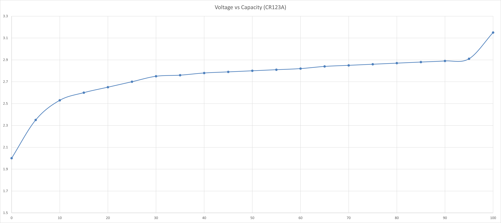

The curve is then split into a few regions where each region could be reasonably linearised with a line of best fit. The straight line equation of each linearised region is obtained and the battery percentage value could be calculated correspondingly.

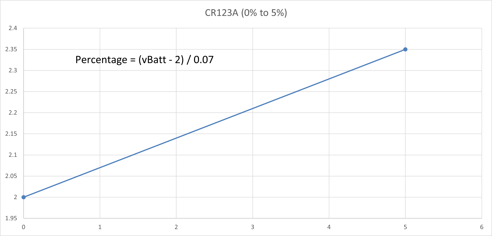

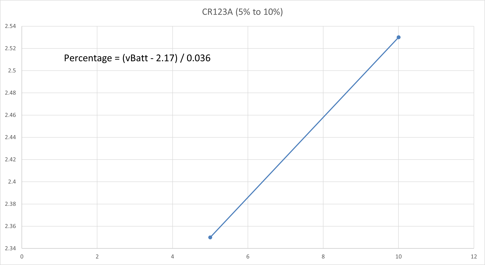

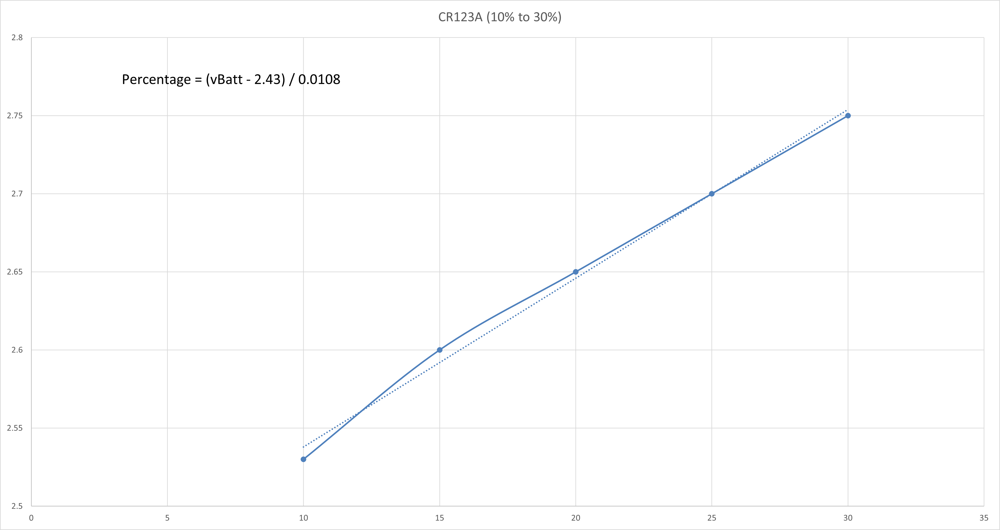

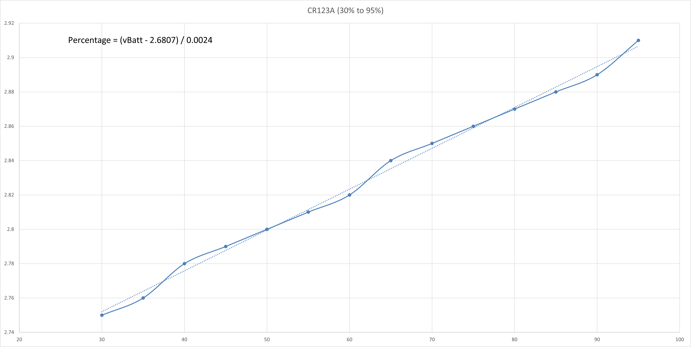

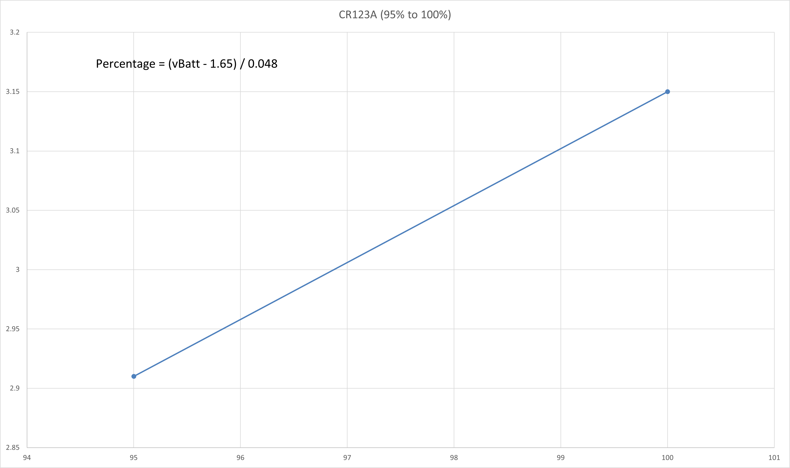

## References
- Another RCR123A charge/discharge curve could be found [here](https://lygte-info.dk/review/batteries2012/GTF%20TR16340%202800mAh%20(White)%20UK.html).
- The charge/discharge curve of the CR123A battery type is obtained from [Energizer datasheet](https://data.energizer.com/pdfs/123.pdf) and [Duracell datasheet](https://www.duracell.com/wp-content/uploads/2021/06/CR123_US.pdf).