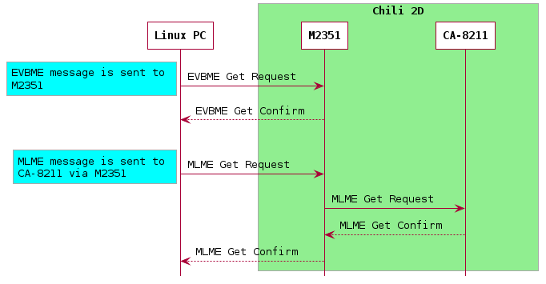
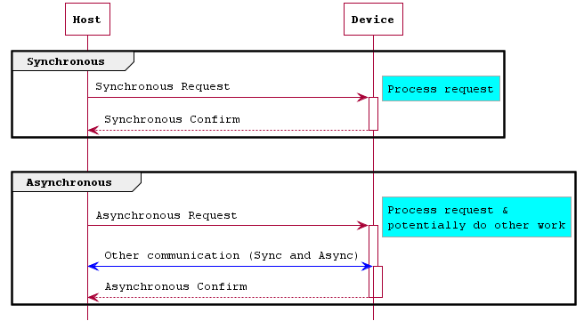

# Cascoda Message Format

The CA-821x platforms and Cascoda SDK all share the same, simple, binary message format which encapsulates data inside a packet comprising of a ``Command``, ``Length`` then ``Payload``. This format is commonly known as a ``TLV`` (Type, Length, Value). In the case of Cascoda messages, the ``Command`` and ``Length`` fields are each 1 octet. The ``Payload`` is a field with a length in octets as specified by the ``Length`` field. Many Cascoda message commands operate in a Request/Response manner, with both synchronous and asynchronous responses possible. The Request/Confirm/Indication/Response terminology is used from the IEEE 802.15.4 spec.

- **Indication**: A message from the device to the host
- **Request**: A message from the host to the device
- **Confirm**: A message from the device to the host, in response to a **request**
- **Response**: A message from the host to the device, in response to an **indication**

The term 'Host' refers to the higher level 'controlling' platform, and the term 'Device' refers to the device being controlled. For instance, when you plug a Chili2D dongle into a PC, the PC is the host of the M2351 microcontroller on the Chili2D, and the M2351 is the host of the CA-8211.

The use of the Cascoda message format is specified in more detail for the CA-821x platforms in the respective datasheets, available on the [Cascoda website](https://www.cascoda.com/products/chips/product/) under the relevant product.

This information is only required for informational/analysis purposes, or if writing a custom driver. If using the Cascoda SDK, then the functions in ``ca821x-api/include/ca821x_api.h``,  ``posix/ca821x-posix/include/ca821x-posix/ca821x-posix-evbme.h`` should be used instead of constructing messages directly.

## Message Structure

The structure of a Cascoda TLV message is quite simple, and comprises of 3 fields.

- The first field of the message is the ``Command`` field. It is one octet in length.
- The second field of the message is the ``Length`` field. It is one octet in length.
- The third field of the message is the ``Payload`` field. It is ``n`` octets in length, where ``n`` is the value of the ``Length`` field. The contents and structure of the ``Payload`` field depend on the value of the ``Command`` field.

<table>
<tr>
  <th>Field Name</th>
  <td>Command</td>
  <td>Length</td>
  <td>Payload</td>
</tr>
<tr>
  <th>Field Length (octets)</th>
  <td>1</td>
  <td>1</td>
  <td>(Length)</td>
</tr>
</table>

## Command

The ``Command`` field, sometimes called the ``Command ID`` or ``CmdId`` field, describes how the ``Payload`` field should be interpreted. In addition, bit 6 (0x40) affects the message flow. If a ``Command`` has bit 6 set, then the command should be treated as a 'Synchronous' command. If not, it is an 'Asynchronous' command. See the [Asynchronous/Synchronous](#asynchronoussynchronous-commands) section for more info.

The ``Command`` field also determines which layer shall process the command. For instance, some will be processed by the MAC on the CA-821x, whereas others will be processed by the Evaluation Board Management Entity (EVBME) on the host processor.

For example, in the situation where a Linux PC is communicating over USB to a Chili 2D dongle (which includes an M2351 host CPU and CA-8211 transceiver), the following exchange is possible:

The definitive list of commands that go to the EVBME can be found in ``ca821x-api/include/evbme_messages.h`` in ``enum evbme_command_ids``. The definitive list of commands that go to the MAC (CA-821x) can be found in ``ca821x-api/include/mac_messages.h`` in ``enum spi_command_ids``. The CA-821x datasheets also contains a detailed list of the commands and the payload structures.

## Length

The ``Length`` field describes the length of the ``Payload`` field. It can have any value in the range 0-254 (inclusive).

## Payload

The ``Payload`` field is binary data. The structure, characteristics and semantics of the content is determined by the ``Command`` field, and the length is determined by the ``Length`` field. For the structure of the ``Payload`` for CA-821x commands, consult the datasheet, available on the [Cascoda website](https://www.cascoda.com/products/chips/product/) under the relevant product. The ``ca821x-api/include/mac_messages.h`` header can also be used. For the structure of the ``Payload`` for EVBME commands, consult the ``ca821x-api/include/evbme_messages.h`` header.

## Asynchronous/Synchronous commands

For Request – Confirm primitive pairs there are 2 message types: synchronous and asynchronous messages. Although there is no
distinction between the physical data exchange for a synchronous and asynchronous message packet, synchronous messages require
an immediate confirm and are therefore treated with priority. Asynchronous messages do not require or cannot return an immediate
confirm, such as a MCPS-DATA Request, where the confirm can only be issued once the data packet has been sent.

For this reason, when a synchronous request is sent, no further message should be sent until the corresponding confirm has been
received. It is permissible to use a sensible timeout such as 500ms, but a failure here is extremely rare and potentially represents
a fatal error that should not go unhandled.

## Additional notes

### 0xFF Command ID/Length

The ``Command`` and ``Length`` field value '0xFF' is reserved, and cannot be used. In the SPI protocol between the CA-821x, it is used as the 'idle' octet, signifying that there is no data to transmit. This is required due to the nature of SPI being always bidirectional.
