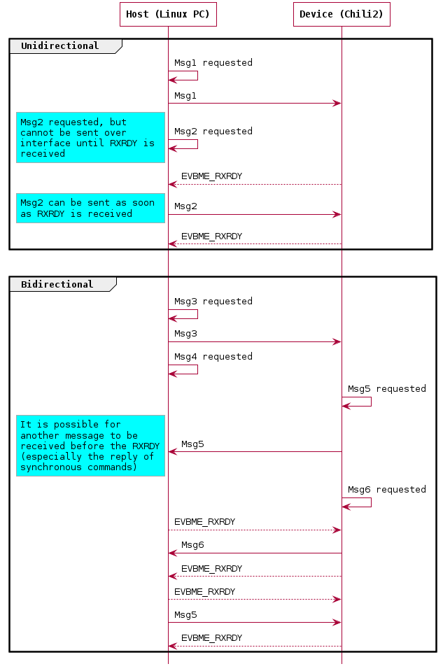
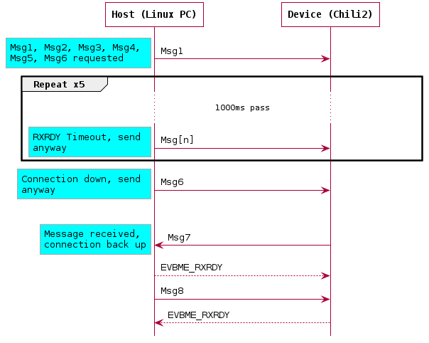
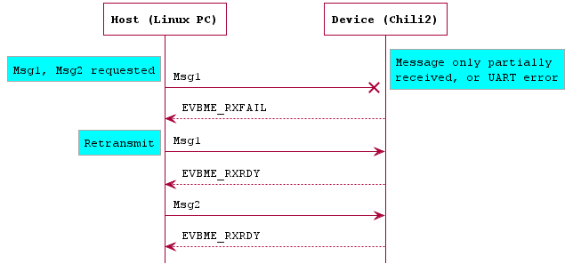

# Cascoda UART Host Interface

The Cascoda UART interface is one of the methods for communicating between the Cascoda Chili modules and a host platform. It is built on top of plain, 2 wire bidirectional UART. The protocol is full duplex, packet based and acknowledged. By using acknowledged messages, and not hardware flow control, the required number of GPIOs dedicated to the communication is only 2, while maintaining the benefit of higher throughputs.

This information is only required for informational/analysis purposes, or if writing a custom driver - the Cascoda SDK provides implementations for supported platforms.

## Implementations

The Cascoda SDK contains two implementations of this interface, one for baremetal platforms, and one for posix systems. For the Cascoda implementations of this interface, see ``posix/ca821x-posix/source/uart-exchange`` and ``baremetal/cascoda-bm-driver/source/cascoda_serial_uart.c``.

## UART Characteristics

The underlying UART configuration is flexible, as the higher layer protocol described in this document does not rely on it. In particular, the baud rate is configurable using the ``CASCODA_CHILI2_UART_BAUDRATE`` CMake cache variable for the Chili 2, or the ``CASCODA_UART`` environment variable on Posix systems ([see here](../../posix/ca821x-posix/README.md#uart)).

The Default parameters for the UART using the Chili 2 are:
- 1 000 000 Baud (1MBaud)
- 8 bit characters
- 1 stop bit
- No hardware flow control
- No parity bit
- UART0 Channel

## Message Structure

The message structure sent over the UART interface is the [Cascoda message format](cascoda-tlv-message.md), with the addition of a single Start-Of-Message (SOM) octet. The value of the SOM octet is ``0xDE``, and it is prepended to the message. The SOM byte is used primarily as a means of error detection - if it is not the first byte of a message that is received, then the system is in an uncertain state and needs to be recovered.

Immediately following the SOM octet is the Cascoda TLV message, which includes the length information.

<table>
<tr>
  <th>Field Name</th>
  <td>SOM (0xDE)</td>
  <td>Cascoda TLV Message</td>
</tr>
<tr>
  <th>Field Length (octets)</th>
  <td>1</td>
  <td>(2 - 256)</td>
</tr>
</table>

## Flow Control / Acknowledgement

To reduce the required number of GPIOs, hardware flow control is not used. Instead, each message transmitted requires an 'Acknowledgement' (also called ``EVBME_RXRDY``) in response, before the next message will be transmitted. This applies to both directions, and the only exception to this requirement are the ``EVBME_RXRDY`` & ``EVBME_RXFAIL`` messages themselves.

The full ``EVBME_RXRDY`` message, including SOM and Cascoda TLV message is the byte sequence:

```
0xDE - SOM
0xAA - EVBME_RXRDY Command ID
0x00 - Payload Length 0
```

Messages must be processed asynchronously on the UART level, as it is legitimate for multiple messages to be received before the ``EVBME_RXRDY`` is received.

<p align="center"></p>

A timeout of 1000ms should be used when waiting for the ``EVBME_RXRDY``. If 5 ``EVBME_RXRDY`` messages in a row are missed, and no other messages are received, the connection should be assumed to be down. In this case, there is no need to wait for ``EVBME_RXRDY`` messages before transmitting the next message. The behaviour should return to normal when any message including ``EVBME_RXRDY`` is received.

<p align="center"></p>

## Rx Fail / Negative Acknowledgement

In the case that an error is detected in the received message, or the full message is not received within a 200ms timeout, an ``EVBME_RXFAIL`` message should be sent by the receiver. The transmit side must then retransmit the dropped message in full. This is valid in both communication directions. The transmit side must also reset the ``EVBME_RXRDY`` timeout upon retransmission.

The full ``EVBME_RXFAIL`` message, including SOM and Cascoda TLV message is the byte sequence:

```
0xDE - SOM
0xAB - EVBME_RXFAIL Command ID
0x00 - Payload Length 0
```

<p align="center"></p>
