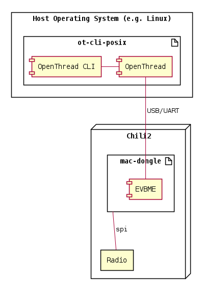
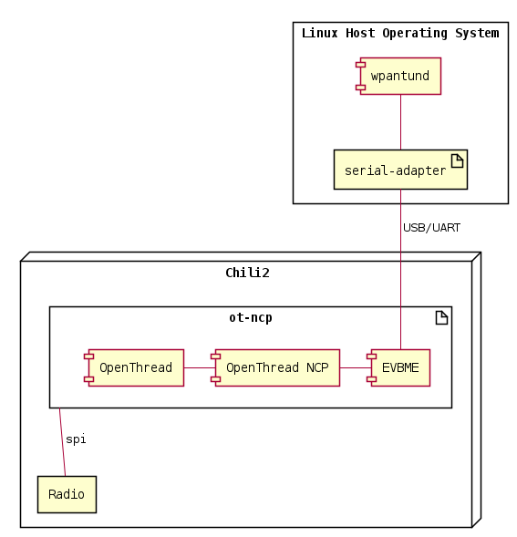

# Cascoda System Architecture

The Cascoda SDK is cross-platform, and flexible in the architecture of the system. That is, many modules of the SDK
are able to run on both baremetal and OS platforms (Windows, Linux, etc.). In particular, the network stack is designed
so that it can be run entirely on a baremetal platform, or run on a host platform (an OS), communicating with an attached
Chili2 for radio operations.

For instance, when running the OpenThread stack with a CLI, it is able to run on the Chili2D platform with the 
[ot-cli](../../baremetal/cascoda-bm-thread/example) application, and present the CLI over the USB or UART interface in
a way that can be accessed with [serial-adapter](../../posix/app/serial-adapter).

Alternatively, the same application can run on the host OS, as [ot-cli-posix](../../posix/ca821x-posix-thread/example/),
using a connected [mac-dongle](../../baremetal/app/mac-dongle) for IEEE-802.15.4 radio operations.

The [chilictl](../../posix/app/chilictl) application does not fit in this model, and can communicate with any connected
Chili device. It is used for generic tasks such as enumerating and reflashing devices, using the core [EVBME](evbme.md)
functionality.

## On-Module

This architecture has every important part of the stack running on the Chili2 platform. The serial interface is used
only for user-level interactions and control, such as by [serial-adapter](../../posix/app/serial-adapter) or
[ocfctl](../../posix/app/ocfctl) depending on the firmware used. Some firmwares may not even support serial communications.

Note that for communications between the Chili2 and a host system, the host system must be [correctly configured](../../docs/dev/development-setup.md).

Some examples of fully on-module examples are:
- [ot-cli](../../baremetal/cascoda-bm-thread/example)
- [ocf-light](../../ocf)
- [ot-sed-thermometer](../../baremetal/app/ot-sed-thermometer)

For standalone end-products that are capable of being run on a single microcontroller, this is a sensible architecture to use.

## Radio Co-Processor

This architecture has the network layer and above running on a host platform, such as an embedded linux system. A Chili2
module running [mac-dongle](../../baremetal/app/mac-dongle) is used for radio operations.

Note that for communications between the Chili2 and a host system, the host system must be [correctly configured](../../docs/dev/development-setup.md).

Some examples of radio co-processor examples are:
- [ot-cli-posix-ftd](../../posix/ca821x-posix-thread/Readme.md#ot-cli-posix-ftd-mtd)
- [ot-sensordemo-server](../../posix/app/ot-sensordemo-server)
- [sniffer](../../posix/app/sniffer)

This architecture is suitable for products such as Routers, which are connected to linux systems, or for initial
development of applications running over Thread, without the constraints of an embedded platform.

## Network Co-Processor

This architecture has the network layer running on the Chili2 module, with [ot-ncp](../../baremetal/cascoda-bm-thread/example/README.md#ot-ncp),
which is connected to the wpantund tool as described in the ot-ncp documentation. This exposes the Thread interface
as a Linux network interface, which allows an application layer to running on the Linux system to use Thread as a network.

This architecture is quite specific, and often it is worth considering the Radio Co-Processor instead, with the 
[ot-ncp-posix](../../posix/ca821x-posix-thread/Readme.md#ot-ncp-posix) instead of ot-ncp. However if the host processor
is also highly constrained, or cannot meet the timing requirements to run the OpenThread stack, then this model is available.

