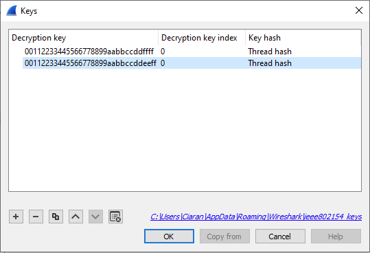
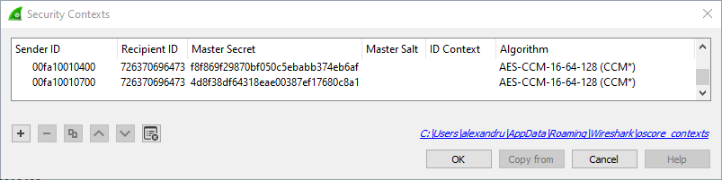
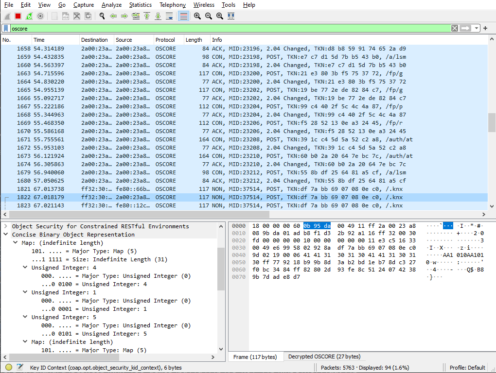
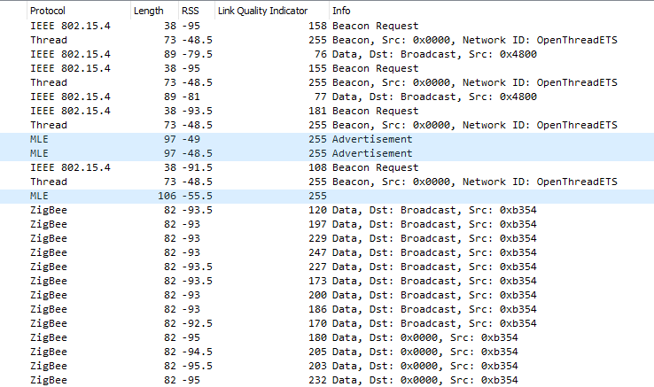

# Sniffer

A hosted program for sniffing IEEE 802.15.4 traffic on a specific channel.

The sniffer uses a Chili2D to passively sniff radio traffic. The sniffed radio traffic can be decoded by Wireshark and interpreted as Thread, IPv6, CoAP or DTLS, based on its contents.

Prebuilt Windows binaries of the sniffer can be found in the [Windows release of the Cascoda SDK.](https://github.com/Cascoda/cascoda-sdk/releases/)

## Table of Contents
- [Sniffer](#sniffer)
  - [Table of Contents](#table-of-contents)
  - [Quick Start](#quick-start)
  - [Configuring Wireshark](#configuring-wireshark)
  - [Detailed Explanation](#detailed-explanation)


## Quick Start

Connect a Chili2D running the USB `mac-dongle` binary to your computer. Alternatively, [purchase a Packet Sniffer dongle from one of our distributors](https://www.cascoda.com/wheretobuy/).

Once you [download and install the Cascoda Windows Tools](https://github.com/Cascoda/cascoda-sdk/releases/latest), use the following terminal command to start a sniffer on channel 21, and open a Wireshark window to view the sniffed packets. This is the most common usecase and it works on Windows & Linux desktops.
```bash
./sniffer 21 -w
```

Alternatively, when using a headless computer, you can start a sniffer on channel 21, output to stdout in the .pcap format & pipe to tshark which is receiving on stdin.
```bash
./sniffer 21 -p | tshark -i -
```

On headless computers it may also useful to start a sniffer on channel 21 & save to a file called capture.pcap, which can later be opened by Wireshark.
```bash
./sniffer 21 -p > capture.pcap
```

## Configuring Wireshark

### Thread Configuration

Before Wireshark can decode secured Thread traffic, the master key of the Thread network must be entered. If your network was created using [Cascoda's KNX IoT Hub](https://www.cascoda.com/products/knx-iot-hub/), [click here for an explanation of how to obtain the key](/docs/guides/border-router-setup.md#Thread-Administration). 

Once the key is obtained, navigate to Edit -> Preferences, expand the Protocol tab in the left-hand side of the pop-up window and scroll down to the "IEEE 802.15.4" protocol. Hit the Edit button next to Decryption Keys, and then hit the plus button to add a new key. After pasting in your key, ensure that the "Key hash" value of the key entry is set to "Thread hash", so that the newly made key entry is used for Thread networks. Hit "Ok" on all windows to save your work.

Here is an example configuration where two Thread key entries have been added:


After a correct master key has been input, 15.4 traffic should automatically be decoded as Thread - you should be able to see the 6LoWPAN headers on most packets. Some application-layer protocols such as DNS, NTP, CoAP are also decoded.

### CoAP Configuration

Occasionally, Wireshark fails to detect the high level protocol used in some packets. These will show up as plain UDP packets with large payloads. To decode them, right-click on these packets and select "Decode As...". Then, edit the Current field of the "UDP port" entry at the bottom, and select the protocol you are expecting to decode. For KNX-IoT, this is CoAP. For OCF over Thread, this is usually CoAP or DTLS. Thread Management Framework messages are sent on port 61631, also using CoAP.

### OSCORE Configuration

Once the CoAP headers are configured, you should be able to see KNX-IoT discovery requests and responses. However, runtime programming & S-Mode communications are encrypted using OSCORE, and you will need the IDs from the Access Token to successfully decrypt these.

Right-click an OSCORE packet you want to decode, and navigate to Protocol Preferences -> Object Security for Constrained RESTful Environments -> Security Contexts. In this window, you may press the Plus button to add a new security context. You must populate the Sender ID and Master Secret fields with details from the Access Token, encoded as hexdecimal strings. If the Recipient ID and/or ID Context are set in the Access Token, you will also have to populate these fields, or decryption will fail.

Here is an example Access Token created by our Linker. The information Wireshark needs lives under the keys 8 -> 4. Within this map, the value under CBOR integer key 2 corresponds to the Master Secret, 7 is the Sender ID and 0 is the Recipient ID. The ID Context would be found at key 6 of this map.

```
{
	38: 2,
	0: "00fa10010400",
	9: [
		"if.i",
		"if.o",
		"if.g.s",
		"if.c"
	],
	8: {
		4: {
			2: h'F8F869F29870BF050C5EBABB374EB6AF',
			7: h'00FA10010400',
			0: h'726370696473'
		}
	}
}
```

Within Wireshark, this Access Token corresponds to the first Security Context in the screenshot below.



Once you have configured your security contexts, you should be able to see every detail of the KNX-IoT communications, as seen below:



 If you are using the Cascoda KNX-IoT Linker, some views of the Access Token are encoded as Base64. These [must be decoded to Hex before being put into Wireshark, using an online tool](https://base64.guru/converter/decode/hex).

## Wireshark Tips

### Filtering Packets

The [Wireshark Display Filters](https://www.wireshark.org/docs/wsug_html_chunked/ChWorkBuildDisplayFilterSection.html) are very useful for understanding what a busy network is doing. You can filter out irrelevant traffic (filter `coap && oscore` is great for KNX-IoT), show requests to a given URI (`oscore.opt.uri_path == auth` for example shows access token modifications) or filter by address (`ipv6.src == fe80:... || ipv6.dst == fe80:...`). For sniffing KNX-IoT traffic, the filter `ipv6 && udp && !mdns && !dns` shows all KNX-IoT packets, but may also show irrelevant packets, especially on Ethernet. After you [configure the correct CoAP UDP ports](#coap-configuration), the `coap` filter works best.

You can right-click on a decoded packet header and select Apply as Filter to visually populate the Display Filter.

### View Received Signal Strength & Link Quality Indication

Out of the box, our sniffer displays RSS & LQI data for every single received packet. This can be seen by clicking on a packet and expanding it's "IEEE 802.15.4 TAP" header. This data can also be displayed in the main packet window by fully expanding the TAP header, right-clicking on the LQI or RSS measurement and selecting Apply as Column.



### Better CBOR decoding

The CBOR view within Wireshark can be quite hard to read, but you can use it alongside the [online CBOR playground.](https://cbor.me/) In the packet dissection view, right click on the "Concise Binary Object Representation" field, select "Copy -> ...as a Hex Stream" paste it into the hex section of the website, and press the arrow to decode.

## Sniffer Details

The Cascoda sniffer can run on Windows or Posix and can:
- Capture to stdout
- Output to a pcap file
- Stream directly to wireshark/tshark

The sniffer does not _directly_ participate in Thread or 802.15.4 networks: it is a passive device that cannot transmit any packets. It is able to decode Thread traffic by intercepting packets within its reception range and decrypting the payload using a user-supplied masterkey.

Run ./sniffer with no args to print the help page.

```
sniffer.exe [OPTIONS] CHANNEL
        Print all received packets on channel (11-26)

DESCRIPTION
        Sniffer program to use the CA-8211 to capture packets on a channel.

        -p             PCap mode, output pcap data instead of descriptive hex
                       dump. If this is used in conjunction with pipes, can be
                       used to stream to wireshark

        -d             Debug mode, print verbose information to stderr.

        -n [PIPENAME]  Output to a named pipe/fifo, which can be read by
                       wireshark or another program. Most useful in conjunction
                       with '-p'.

        -w             Open WireShark to process the packet capture. Implies -p
                       and -n (random name for pipe if not provided separately).

        -W [PATH]      Open WireShark at the path to process the packet capture.
                       Implies -w.

        -s [SerialNo]  (Optional) Specify the serial number of the target device.
```

For instance the ``-w`` argument can be used to automatically boot wireshark and connect. On unix platforms the usage is more flexible and can use command line pipes such as:

```bash
# Start sniffer on channel 21, pcap output, pipe to tshark, which is receiving on stdin.
./sniffer 21 -p | tshark -i -
```
